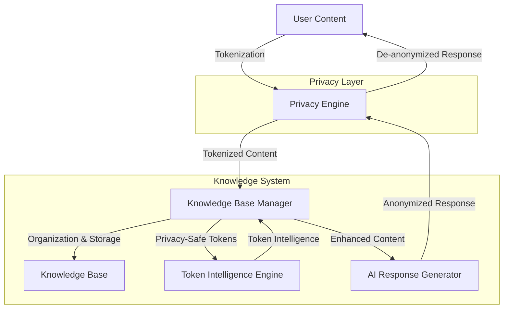

# Knowledge Base System with Integrated Privacy

A unified system that combines intelligent knowledge management with built-in privacy protection.

## 👋 Welcome!

This system provides a secure way to manage your knowledge while protecting privacy through intelligent tokenization. The project integrates:

1. **Knowledge Base Manager**: Organizes and processes your notes, todos, events, and other content
2. **Privacy Layer**: Ensures your data remains private through smart anonymization
3. **Token Intelligence**: Generates insights from privacy tokens without accessing original data

## ✨ Key Features

### Privacy-First Design
- **Smart Anonymization**: Preserves essential information while protecting personal identifiers
- **Automatic De-anonymization**: System responses are automatically de-anonymized for users
- **Entity Relationships**: Links related information (person ↔ phone, email, etc.) using privacy tokens
- **Perfect Session Isolation**: Complete privacy boundaries between usage contexts

### Smart Organization
- **Intelligent Processing**: Automatically categorizes and organizes your content
- **Context Awareness**: Recognizes relationships between different pieces of information
- **Personalized Intelligence**: Learns from usage patterns while maintaining privacy

### Rich Capabilities  
- **Multiple Content Types**: Notes, tasks, calendar events, projects, and more
- **Search & Discovery**: Find connections across your knowledge base
- **API Integration**: Connect with other tools through a clean REST API
- **Conversational Interface**: Chat naturally with your knowledge base

### Quality & Reliability
- **Comprehensive Test Coverage**: 96% test coverage for privacy components
- **Performance Benchmarking**: Continuous performance monitoring
- **Robust Error Handling**: Graceful degradation when components fail

## 🚀 Getting Started

### Installation

```bash
# Install from PyPI
pip install knowledge-base-system

# Or install from source
git clone https://github.com/taiscoding/knowledge-base-system.git
cd knowledge-base-system
pip install -e .
```

### Quick Example

```python
from knowledge_base import KnowledgeBaseManager

# Initialize the integrated knowledge base
kb = KnowledgeBaseManager()

# Create a privacy session
session_id = kb.session_manager.create_session("balanced")

# Process content with privacy
result = kb.process_with_privacy(
    "Need to meet with John about the marketing project tomorrow at 2pm.",
    session_id=session_id
)

# See what was extracted
print(f"Found {len(result['extracted_info']['todos'])} todos")
print(f"Found {len(result['extracted_info']['calendar_events'])} events")
print(f"Privacy-safe text: {result['original_content']}")

# Process and get AI response
response = kb.process_and_respond(
    "Call John tomorrow about the project status.",
    session_id=session_id
)

print(f"AI Response: {response['response']['message']}")
print(f"Suggestions: {[s['text'] for s in response['response']['suggestions']]}")
```

## 🔄 System Architecture

The system is designed with privacy built into every component:



This flow ensures that:
1. User input is properly anonymized
2. Processing happens with privacy tokens (never the original data)
3. Responses are automatically de-anonymized before being shown to users

- **Privacy Engine**: Smart anonymization of sensitive information
- **Knowledge Base**: Manages content organization and processing
- **Token Intelligence**: Provides privacy-safe insights from tokens
- **Content Store**: Securely stores all your knowledge
- **Response Generator**: Creates helpful responses and suggestions

## 📚 Documentation

For detailed information, see:

- [User Guide](docs/user_guide.md) - Start here if you're new!
- [API Reference](docs/api.md) - Technical API details
- [Architecture](docs/architecture.md) - System design overview
- [Privacy Design](docs/privacy_design.md) - How the system protects your data
- [Integration Guide](docs/integration_guide.md) - Connect with other systems
- [Test Coverage](docs/test_coverage.md) - Current test coverage report
- [Contributing Guide](docs/contributing.md) - How to contribute to the project

## 🔒 Privacy & Security

This system was built with privacy as the core principle:

1. **Built-in Privacy**: Privacy engine integrated into every operation
2. **Smart Anonymization**: Only sensitive data is tokenized, preserving essential context
3. **Zero Re-identification Risk**: Design prevents any possibility of reconstructing original data
4. **Session Isolation**: Usage contexts are kept completely separate
5. **Entity Relationships**: Understand connections between entities without exposing identities

For a complete privacy overview, see our [Privacy Design](docs/privacy_design.md) documentation.

## 🧪 Testing & Quality

We maintain high code quality through:

1. **Comprehensive Testing**: 96% test coverage for privacy components
2. **Performance Monitoring**: Regular benchmarking of key operations
3. **Integration Tests**: End-to-end workflow testing
4. **Continuous Improvement**: Ongoing enhancement of tests and code quality

For more details, check out our [Test Coverage Report](docs/test_coverage.md).

## 📝 Usage Examples

### CLI Interface

```bash
# Process text with privacy
knowledge-base process-private "Call Jane tomorrow about the project deadline"

# Interactive chat mode with privacy
knowledge-base chat

# Create a new privacy session
knowledge-base create-session --privacy-level balanced

# Search across content
knowledge-base search "project"
```

### API Usage

```bash
# Start the API server
python -m scripts.api_server

# Create a session and process with privacy
curl -X POST "http://localhost:8000/sessions" \
  -H "Content-Type: application/json" \
  -d '{"privacy_level": "balanced"}'

# Process with privacy
curl -X POST "http://localhost:8000/process-private" \
  -H "Content-Type: application/json" \
  -d '{"content": "Call John at 555-0123", "session_id": "SESSION_ID_HERE"}'
```

### Development & Testing

```bash
# Install development dependencies
pip install -e ".[dev]"

# Run tests
python -m pytest

# Run tests with coverage report
python -m pytest --cov=knowledge_base

# Run performance benchmarks
python -m pytest tests/benchmarks/ --benchmark-only
```

## 👥 Contributing

We welcome contributions to the Knowledge Base System! See the [Contributing Guide](docs/contributing.md) for details on:

- Setting up your development environment
- Testing standards and requirements
- Code style and documentation
- Pull request process

## 📄 License

This project is licensed under the MIT License - see the [LICENSE](LICENSE) file for details.