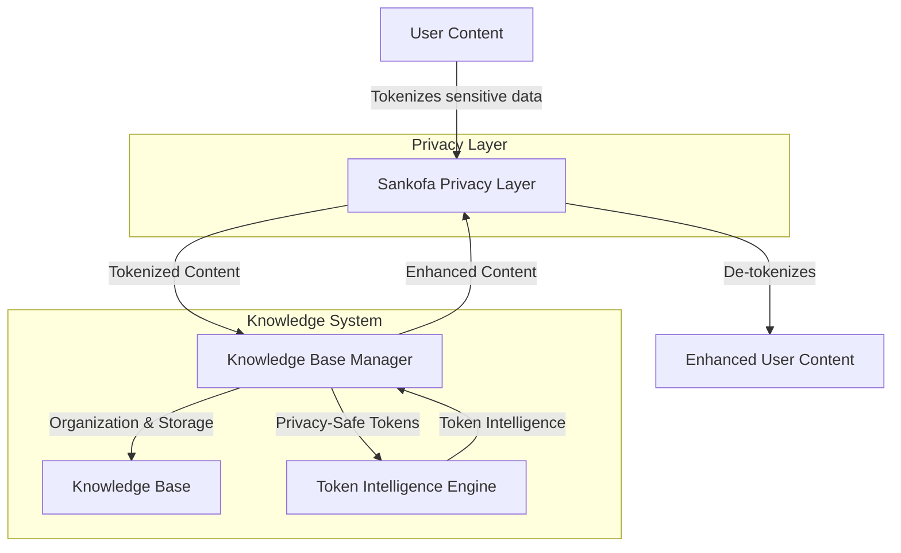

# Knowledge Base & Token Intelligence System

A privacy-first knowledge management system that combines intuitive data organization with privacy-preserving token intelligence.

## 👋 Welcome!

This system provides a secure way to manage your knowledge while protecting privacy through token-based intelligence. The project consists of two integrated components:

1. **Knowledge Base Manager**: Organizes and processes your notes, todos, events, and other content
2. **Token Intelligence System**: Generates insights from privacy tokens without accessing original data

## ✨ Key Features

### Privacy-First Design
- **Zero Data Exposure**: Token intelligence works exclusively with privacy tokens, never with original data
- **Privacy Layer Integration**: Seamless connection with the Sankofa privacy system
- **Perfect Session Isolation**: Complete privacy boundaries between usage contexts

### Smart Organization
- **Intelligent Processing**: Automatically categorizes and organizes your content
- **Context Awareness**: Recognizes relationships between different pieces of information
- **Personalized Intelligence**: Learns from usage patterns while maintaining privacy

### Rich Capabilities  
- **Multiple Content Types**: Notes, tasks, calendar events, projects, and more
- **Search & Discovery**: Find connections across your knowledge base
- **API Integration**: Connect with other tools through a clean REST API
- **Batch Processing**: Efficiently process multiple requests

## 🚀 Getting Started

### Installation

```bash
# Install from PyPI
pip install knowledge-base-system

# Or install from source
git clone https://github.com/yourname/knowledge-base-system.git
cd knowledge-base-system
pip install -e .
```

### Quick Example

```python
from knowledge_base import KnowledgeBaseManager
from token_intelligence import TokenIntelligenceEngine

# Initialize the knowledge base
kb = KnowledgeBaseManager()

# Process content
result = kb.process_stream_of_consciousness(
    "Need to meet with John about the marketing project tomorrow at 2pm."
)

# See what was extracted
print(f"Found {len(result['extracted_info']['todos'])} todos")
print(f"Found {len(result['extracted_info']['calendar_events'])} events")

# Use token intelligence (privacy-preserving)
engine = TokenIntelligenceEngine()
response = engine.generate_intelligence(
    privacy_text="Meeting with [PERSON_001] about [PROJECT_002]",
    preserved_context=["meeting", "project"],
    session_id="example-session"
)

print(f"Intelligence type: {response.intelligence_type}")
print(f"Intelligence: {response.intelligence}")
```

## 🔄 System Architecture

The system is designed with clear separation between components:



- **Knowledge Base**: Manages content organization and processing
- **Token Intelligence**: Provides privacy-safe insights from tokens
- **Content Store**: Securely stores all your knowledge
- **Privacy Layer**: Ensures complete privacy through tokenization

## 📚 Documentation

For detailed information, see:

- [User Guide](docs/user_guide.md) - Start here if you're new!
- [API Reference](docs/api.md) - Technical API details
- [Architecture](docs/architecture.md) - System design overview
- [Privacy Design](docs/privacy_design.md) - How the system protects your data
- [Integration Guide](docs/integration_guide.md) - Connect with other systems

## 🔒 Privacy & Security

This system was built with privacy as the core principle:

1. **Token-Only Intelligence**: The system never needs or processes original personal data
2. **Zero Re-identification Risk**: Design prevents any possibility of reconstructing original data
3. **Perfect Session Isolation**: Usage contexts are kept completely separate
4. **Transparent Design**: Privacy architecture is clearly documented

For a complete privacy overview, see our [Privacy Design](docs/privacy_design.md) documentation.

## 📄 License

This project is licensed under the MIT License - see the [LICENSE](LICENSE) file for details.