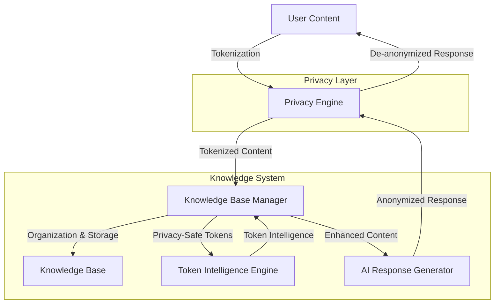

# Knowledge Base System Architecture

*Last updated: June 27, 2025*

## Overview

The Knowledge Base System is built on a modular, component-based architecture designed for privacy, extensibility, and performance. This document outlines the high-level architecture, key components, and data flows.

## System Components

The system consists of two main components with integrated privacy features:

1. **Knowledge Base Manager**: Organizes and processes content, extracts information, handles storage, and includes integrated privacy functionality
2. **Token Intelligence System**: Generates insights from tokenized content without accessing original data

## Component Architecture

### Knowledge Base Manager

```
┌───────────────────────────────────────────────────────┐
│                Knowledge Base Manager                 │
├─────────────┬───────────────────────┬─────────────────┤
│             │                       │                 │
│  Manager    │  Content Types        │  Privacy        │
│             │  - Note               │  - Engine       │
├─────────────┤  - Todo               │  - Session Mgr  │
│             │  - CalendarEvent      │  - TokenBridge  │
│  Utils      │  - Project            │                 │
│             │  - Reference          │                 │
└─────────────┴───────────────────────┴─────────────────┘
```

- **Manager**: Core class that handles content processing and organization
- **Content Types**: Data classes for different types of content
- **Utils**: Configuration, helpers, and utility functions
- **Privacy**: Integrated privacy components for anonymization and session management

### Token Intelligence System

```
┌─────────────────────────────────────────┐
│         Token Intelligence System       │
├─────────────┬───────────────┬───────────┤
│             │               │           │
│  Core       │  Intelligence │  API      │
│  - Engine   │  - Generators │  - REST   │
│  - Models   │  - Analyzers  │  - Batch  │
├─────────────┼───────────────┼───────────┤
│             │               │           │
│  Storage    │  Utils        │           │
│             │               │           │
└─────────────┴───────────────┴───────────┘
```

- **Core**: Main engine and data models
- **Intelligence**: Generators and analyzers for different token types
- **API**: REST API for accessing token intelligence
- **Storage**: Token profile and relationship storage
- **Utils**: Configuration, logging, validation

## Complete Data Flow



The detailed flow through the system:

1. User creates content with sensitive information
2. Knowledge Base tokenizes sensitive information through integrated privacy engine
3. Knowledge Base processes and organizes tokenized content
4. Token Intelligence analyzes tokens and generates insights without seeing original data
5. Knowledge Base enhances content with token intelligence
6. Knowledge Base de-tokenizes content before returning to user

## Privacy Architecture

Privacy is built directly into the Knowledge Base Manager:

1. **Integrated Privacy Engine**: Handles tokenization and de-tokenization
2. **Session Manager**: Maintains privacy sessions for consistent tokenization
3. **Token Intelligence Bridge**: Connects to Token Intelligence with fallback capabilities
4. **Perfect Token Isolation**: Token Intelligence only ever sees tokens, never original data
5. **Privacy Validation**: All operations are validated for privacy compliance

### Privacy Engine Operation

The Privacy Engine is responsible for:

1. **Smart Anonymization**: Detects entities like names, emails, phone numbers, locations
2. **Token Management**: Ensuring consistent tokens for the same entities
3. **Relationship Tracking**: Maintaining relationships between tokenized entities
4. **Text Reconstruction**: Converting tokenized text back to original format

## API Layer

The API layer provides HTTP endpoints for client applications to interact with the Knowledge Base System:

**Key Components**:
- **Endpoints**: Flask routes handling HTTP requests and responses
- **Validation**: Request validation ensuring proper data format and content
- **Batch Handler**: Specialized component for efficient batch processing

### Knowledge Base API Endpoints

```
┌───────────────────────────────┐     
│ Knowledge Base API            │     
├───────────────────────────────┤     
│/process                       │     
│/process-private               │     
│/search                        │     
│/conversation                  │     
│/sessions                      │     
└───────────────────────────────┘     
```

### Token Intelligence API Endpoints

```http
POST /analyze_privacy_tokens
GET /health
GET /intelligence_stats
GET /token_profile/<token_id>
```

### Request Format Example
```json
{
    "privacy_text": "Meeting with [PERSON_001] about [PROJECT_002]",
    "session_id": "uuid",
    "preserved_context": ["meeting", "project"],
    "entity_relationships": {
        "[PERSON_001]": {"type": "person"},
        "[PROJECT_002]": {"type": "project"}
    }
}
```

### Response Format Example
```json
{
    "intelligence": {
        "PERSON_001_context": "professional colleague",
        "PROJECT_002_status": "active project"
    },
    "confidence": 0.85,
    "intelligence_type": "professional_collaboration",
    "processing_time_ms": 1
}
```

## Intelligence Generation

Specialized modules generate specific types of intelligence based on token types:

**Key Components**:
- **Person Generator**: Generates intelligence for person tokens
- **Medical Generator**: Generates intelligence for medical/health tokens
- **Document Generator**: Generates intelligence for document tokens
- **Project Generator**: Generates intelligence for project tokens

### Intelligence Generator Implementation

```python
def _generate_person_intelligence(token: str, context: List[str], profile: Dict) -> Dict:
    """Generate intelligence for person tokens."""
    # Professional context
    if any(word in context for word in ['meeting', 'work']):
        intelligence[f"{token}_context"] = "professional colleague"
        
    # Academic context  
    if any(word in context for word in ['paper', 'research']):
        intelligence[f"{token}_expertise"] = "research collaborator"
```

## Integration Points

### Knowledge Base to Token Intelligence

The Knowledge Base communicates with the Token Intelligence system through the TokenIntelligenceBridge:

```python
# Knowledge Base extracts tokenized text
tokenized_text = "Meeting with [PERSON_001] about [PROJECT_002]"

# Create Token Intelligence request through the bridge
token_intelligence = token_intelligence_bridge.generate_intelligence(
    privacy_text=tokenized_text,
    session_id=session_id,
    preserved_context=context_keywords,
    entity_relationships=relationships
)

# Use intelligence to enhance content
enhanced_content = original_content
for token, insight in token_intelligence.items():
    enhanced_content = apply_insight(enhanced_content, token, insight)
```

### Privacy Integration

The privacy functionality is now integrated directly into the Knowledge Base:

```python
# Process content with privacy
result = knowledge_base.process_with_privacy(
    content="Call John Smith about the project tomorrow",
    session_id="session-123",
    privacy_level="balanced"
)

# Process and generate a response with automatic privacy handling
response = knowledge_base.process_and_respond(
    content="Schedule a meeting with Susan Jones",
    session_id="session-123"
)
```

## Testing Architecture

```
┌─────────────────────────────────────────────────┐
│                 Testing Framework                │
├─────────────┬─────────────────┬─────────────────┤
│             │                 │                 │
│  Unit Tests │  Integration    │  Benchmarks     │
│  - Privacy  │  Tests          │  - Performance  │
│  - Core     │  - Workflows    │  - Scaling      │
│  - API      │  - Components   │                 │
├─────────────┴─────────────────┴─────────────────┤
│                                                 │
│              Test Infrastructure                │
│  - pytest                                       │
│  - pytest-cov (coverage)                        │
│  - pytest-mock (mocking)                        │
│  - pytest-benchmark (performance)               │
│                                                 │
└─────────────────────────────────────────────────┘
```

The system includes a comprehensive testing framework:

1. **Unit Testing**: Tests for individual components (overall coverage 72%)
   - Privacy Engine (89% coverage)
   - Session Manager (100% coverage)
   - Token Intelligence Bridge (90% coverage)
   - Manager (75% coverage)

2. **Integration Testing**: Tests for component workflows
   - Privacy workflow from content to tokenization to reconstruction
   - Token consistency across multiple operations
   - Session management and persistence

3. **Performance Benchmarking**: Tests for performance characteristics
   - Text deidentification (small: ~68μs, medium: ~285μs, large: ~2.67ms)
   - Reconstruction (~19μs)
   - Session operations (~76-133μs)
   - Token consistency (~34μs)

## Memory Model

```
┌───────────────┐           ┌───────────────┐
│ Content Store │           │ Token Profiles│
│               │           │               │
│ - Notes       │           │ - Patterns    │
│ - Todos       │           │ - Context     │
│ - Events      │           │ - Frequency   │
│ - Projects    │           │               │
└───────┬───────┘           └───────┬───────┘
        │                           │
        v                           v
┌───────────────────────────────┐   │
│                               │   │
│ Knowledge Base Manager        │◄──┘
│ (with integrated privacy)     │
│                               │
└──────────────┬────────────────┘
               │
               │
        ┌──────▼──────┐
        │     UI      │
        │             │
        └─────────────┘
```

- **Content Store**: Persists content and metadata
- **Token Profiles**: Stores token-based intelligence and patterns
- **No Original Data**: Token profiles never contain original identifiable data

## Configuration Architecture

The system uses a hierarchical configuration system:

1. **Default configurations**: Hardcoded sensible defaults
2. **Configuration files**: YAML files for customization
3. **Environment variables**: Override for deployment-specific settings

## Technical Considerations

### Performance Optimizations

The Knowledge Base System is designed for high performance:

1. **Batch Processing**:
   - Parallel processing with ThreadPoolExecutor for multiple texts
   - Error handling for batch processing failures
   - Optimized for large workloads

2. **Pre-compiled Regex Patterns**:
   - Regex patterns compiled at initialization
   - Avoiding compilation overhead during processing
   - Optimized pattern structure for faster matching

3. **Caching Layers**:
   - Memory caching with TTL for token intelligence results
   - Disk caching for persistence between sessions
   - Efficient cache invalidation mechanisms

4. **Token Processing**:
   - Optimized pattern matching for faster entity detection
   - Efficient token counter management
   - Optimized text reconstruction algorithms

### Security

Privacy protection is fundamental:
- **No Original Data**: Works only with privacy tokens, never original data
- **Token Storage**: Profiles stored securely without original data references
- **API Security**: Validation prevents malformed or malicious requests
- **Perfect Session Isolation**: Complete privacy boundaries between usage contexts

## Deployment Options

### 1. Local Deployment
```bash
# Run locally for maximum privacy
cd scripts
python3 api_server.py
# Access at http://localhost:5000
```

### 2. Production Deployment
- Docker containerization
- Kubernetes orchestration
- Load balancing
- Health monitoring

## Technical Stack

- **Language**: Python 3.8+
- **API**: FastAPI/Flask
- **Storage**: File-based with JSON and Markdown
- **Configuration**: YAML
- **Testing**: pytest ecosystem (pytest, pytest-cov, pytest-mock, pytest-benchmark)
- **Packaging**: Standard Python packaging 