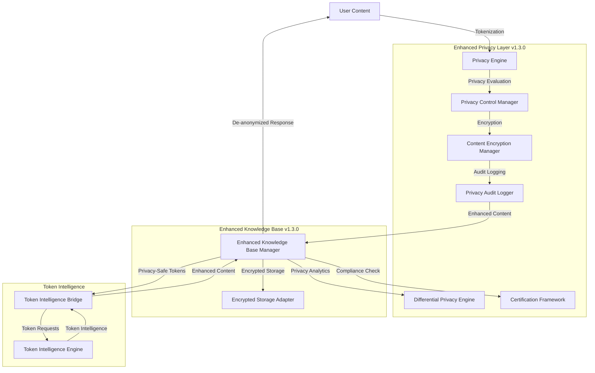
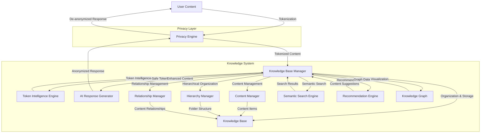

# Knowledge Base System Architecture

*Last updated: December 28, 2025*

## Overview

The Knowledge Base System is designed with a modular architecture that separates concerns and enables flexibility. This document describes the high-level architecture, components, data flow, and design patterns used throughout the system, with special focus on the enhanced privacy features introduced in v1.3.0.

## System Components


### Core Components

1. **Enhanced Knowledge Base Manager** (`knowledge_base/manager.py`)
   - Central orchestrator for the system with integrated privacy enhancements
   - Manages content processing, storage, and retrieval with encryption support
   - Coordinates between privacy, storage, and intelligence components
   - Provides hierarchical organization and relationship management
   - Integrates semantic search and recommendation capabilities
   - **NEW v1.3.0**: Enhanced with 9 privacy-aware methods and comprehensive audit logging

2. **Enhanced Privacy Engine** (`knowledge_base/privacy/`)
   - Handles sensitive information tokenization and detokenization
   - Manages privacy sessions and token mappings
   - Implements smart anonymization for contextual privacy preservation
   - Features circuit breaker pattern for fault tolerance
   - **NEW v1.3.0**: Enhanced with five new privacy modules:
     - **End-to-End Encryption** (`encryption.py`)
     - **Granular Privacy Controls** (`privacy_controls.py`)
     - **Privacy Audit Logging** (`audit_logging.py`)
     - **Differential Privacy** (`differential_privacy.py`)
     - **Privacy Certification Framework** (`certification.py`)

3. **Storage System** (`knowledge_base/storage/`)
   - File-based storage for different content types
   - Handles data persistence and retrieval
   - Implements versioning and backup mechanisms
   - **NEW v1.3.0**: Enhanced with encrypted storage adapter for transparent encryption

4. **Search Engine** (`search/search_index.py`)
   - Provides full-text search capabilities
   - Creates and maintains search indices
   - Supports tags, content types, and relevance filtering
   - **NEW v1.3.0**: Enhanced with searchable encryption support

5. **Token Intelligence** (`token_intelligence/`)
   - Analyzes and processes privacy tokens
   - Generates intelligence insights from relationships
   - Provides contextual token understanding

6. **Hierarchy Management** (`knowledge_base/core/hierarchy_manager.py`)
   - Manages folder structures and content hierarchy
   - Provides navigation through folder trees
   - Maintains parent-child relationships between content items
   - **NEW v1.3.0**: Enhanced with privacy inheritance support

7. **Relationship Management** (`knowledge_base/core/relationship_manager.py`)
   - Handles explicit relationships between content items
   - Supports different relationship types (reference, dependency, etc.)
   - Maintains relationship metadata and descriptions
   
8. **Semantic Search** (`knowledge_base/core/semantic_search.py`)
   - Implements vector embeddings for content similarity
   - Provides semantic search capabilities across content
   - Supports filtering by content type, category, and tags
   
9. **Recommendation Engine** (`knowledge_base/core/recommendation_engine.py`)
   - Provides content recommendations based on relationships and similarity
   - Tracks user interactions for improved recommendations
   - Generates contextual suggestions based on current user activity
   
10. **Knowledge Graph** (`knowledge_base/core/knowledge_graph.py`)
    - Builds graph representations of content relationships
    - Provides visualization data for content networks
    - Supports path finding between content items

### New Privacy Components (v1.3.0)

11. **End-to-End Encryption** (`knowledge_base/privacy/encryption.py`)
    - **KeyManager**: Secure key generation, storage, and rotation with master key protection
    - **ContentEncryptionManager**: AES-GCM and Fernet encryption for content protection
    - **EncryptedStorageAdapter**: Transparent file encryption with metadata protection
    - **Searchable Encryption**: Preserves query capabilities while maintaining security

12. **Granular Privacy Controls** (`knowledge_base/privacy/privacy_controls.py`)
    - **PrivacyLevel Enum**: Four-tier privacy levels (PUBLIC, PROTECTED, PRIVATE, RESTRICTED)
    - **PrivacyRuleEngine**: Evaluates content against privacy rules
    - **PrivacyControlManager**: Manages privacy profiles and inheritance
    - **Content-Specific Profiles**: Tailored privacy rules for different content types

13. **Privacy Audit Logging** (`knowledge_base/privacy/audit_logging.py`)
    - **PrivacyAuditLogger**: Tamper-evident logging using HMAC
    - **ComplianceReporter**: Generates access and operation reports
    - **Log Rotation**: Automatic archiving and retention management
    - **Integrity Verification**: Ensures audit trail authenticity

14. **Differential Privacy** (`knowledge_base/privacy/differential_privacy.py`)
    - **PrivacyBudgetManager**: Epsilon budget tracking and management
    - **DifferentialPrivacyMechanism**: Multiple noise mechanisms (Laplace, Gaussian, Geometric)
    - **PrivacyPreservingAnalytics**: Private statistics, histograms, and top-k queries
    - **Budget Protection**: Prevents privacy budget exhaustion

15. **Privacy Certification Framework** (`knowledge_base/privacy/certification.py`)
    - **ComplianceChecker**: Multi-standard compliance verification (GDPR, CCPA, HIPAA, SOC2, ISO27001)
    - **PrivacyImpactAssessmentTool**: Structured PIA workflow with risk assessment
    - **CertificationReporter**: Comprehensive compliance reports and gap analysis

### Supporting Components

1. **CLI Interface** (`knowledge_base/cli.py`)
   - Command-line interface for system interaction
   - Provides commands for content management and search
   - **NEW v1.3.0**: Enhanced with privacy-aware commands

2. **API Server** (`scripts/api_server.py`)
   - REST API for external integrations
   - Exposes system functionality via HTTP endpoints
   - **NEW v1.3.0**: Enhanced with privacy compliance endpoints

3. **Utilities** (`knowledge_base/utils/`)
   - Configuration management
   - Helper functions
   - Logging and error handling

## Enhanced Data Flow (v1.3.0)

1. **Enhanced Content Ingestion Flow**
   ```
   Raw Content → Enhanced KnowledgeBaseManager → Privacy Engine → Privacy Controls → Encryption → Content Processing → Encrypted Storage
                                                               ↓                      ↓
                                                        Audit Logger            Search Index
   ```

2. **Enhanced Content Retrieval Flow**
   ```
   Query → Enhanced KnowledgeBaseManager → Privacy Controls → Encrypted Storage → Decryption → Privacy Engine → User Display
                                                        ↓
                                                  Audit Logger
   ```

3. **Enhanced Search Flow**
   ```
   Search Query → Enhanced KnowledgeBaseManager → Privacy Controls → Search Engine → Encrypted Storage → Decryption → Privacy Engine → Results
                                               ↓
                                         Audit Logger
   ```

4. **Privacy-Preserving Analytics Flow**
   ```
   Analytics Request → Enhanced KnowledgeBaseManager → Differential Privacy Engine → Privacy Budget Check → Noisy Results
                                                   ↓
                                             Audit Logger
   ```

5. **Compliance Assessment Flow**
   ```
   Compliance Request → Enhanced KnowledgeBaseManager → Certification Framework → Evidence Collection → Gap Analysis → Compliance Report
                                                    ↓
                                              Audit Logger
   ```

## Enhanced Privacy Architecture

### Privacy Component Organization

```
knowledge_base/privacy/
├── __init__.py                         # Enhanced module exports
├── encryption.py                       # End-to-end encryption (NEW v1.3.0)
├── privacy_controls.py                 # Granular privacy controls (NEW v1.3.0)  
├── audit_logging.py                    # Privacy audit logging (NEW v1.3.0)
├── differential_privacy.py             # Differential privacy analytics (NEW v1.3.0)
├── certification.py                    # Privacy certification framework (NEW v1.3.0)
├── adapter.py                          # Privacy integration adapter
├── circuit_breaker.py                  # Circuit breaker patterns
├── session_manager.py                  # Privacy session management
├── smart_anonymization.py              # Smart anonymization engine
└── token_intelligence_bridge.py        # Token intelligence bridge
```

### Enhanced Privacy Data Flow



## Error Handling & Fault Tolerance

### Exception Hierarchy

The system implements a comprehensive exception hierarchy to handle various error scenarios:

```
KnowledgeBaseError
├── ConfigurationError
├── StorageError
├── ContentProcessingError
├── PrivacyError
├── ValidationError
├── NotFoundError
└── RecoveryError
```

Each exception type is specialized for different components and error scenarios, providing consistent error handling across the system.

### Error Handling Strategies

1. **Graceful Degradation**
   - System continues to function with reduced capabilities when components fail
   - Privacy operations fall back to basic processing when advanced features fail
   - Storage operations can use in-memory fallbacks when persistence fails

2. **Comprehensive Logging**
   - Detailed error logging with context and stack traces
   - Different log levels based on error severity
   - Centralized log collection for system monitoring

3. **Recovery Mechanisms**
   - Automatic retry logic for transient errors
   - Session restoration capabilities
   - Cache rebuilding mechanisms

### Circuit Breaker Pattern

The system implements the Circuit Breaker pattern to prevent cascading failures and provide fault tolerance:


#### Circuit Breaker States

1. **CLOSED** - Normal operation
   - All requests flow through normally
   - Failures are counted against threshold

2. **OPEN** - Failure mode
   - Requests are short-circuited immediately
   - Prevents overwhelming failing services
   - Remains open for configured timeout period

3. **HALF_OPEN** - Recovery testing
   - Limited test traffic is allowed through
   - Success transitions back to CLOSED
   - Failure returns to OPEN with reset timeout

#### Implementation

The circuit breaker is implemented in `knowledge_base/privacy/circuit_breaker.py` with the following features:

- Thread-safe state management
- Configurable failure thresholds and timeouts
- Metrics collection for monitoring
- Protected integration with privacy components
- Fallback mechanism configuration

#### Integration

Circuit breakers are integrated with critical system components:

1. **Privacy Engine**
   - Protects token generation and resolution operations
   - Falls back to basic privacy preservation when open

2. **Token Intelligence**
   - Monitors API availability and response times
   - Falls back to cached token information when unavailable

3. **External Services**
   - Prevents overwhelming external dependencies
   - Implements timeout and retry logic

## Design Patterns

### Singleton Pattern
Used for configuration managers and session managers to ensure single instances across the system.

### Factory Pattern
Used for creating different content types and storage backends based on configuration.

### Strategy Pattern
Used for implementing different privacy levels and content processing strategies.

### Observer Pattern
Used for notifying system components about changes in content and configuration.

### Decorator Pattern
Used for adding functionality to content processors and storage backends.

### Circuit Breaker Pattern
Used for fault tolerance in critical components and external service integrations.

## Configuration Management

Configuration is managed through:
- YAML files in the `config/` directory
- Environment variables
- Command-line arguments

Configuration precedence (highest to lowest):
1. Command-line arguments
2. Environment variables
3. Configuration files
4. Default values

## Security Considerations

### Privacy Protection
- Sensitive information is tokenized
- Token mappings are session-specific
- Privacy levels can be configured
- Smart anonymization for contextual understanding

### Authentication & Authorization
- API endpoints require authentication
- Role-based access control for administrative functions
- Token-based authentication for sessions

### Data Security
- Content encryption at rest (optional)
- Secure token storage
- Data minimization practices

## Scalability Considerations

### Current Limitations
- File-based storage limits large data volumes
- Single-instance design for simplicity

### Future Expansion
- Database storage backend option
- Distributed processing capabilities
- Horizontal scaling of components

## Testing Strategy

The system implements a multi-layered testing approach:

1. **Unit Tests**
   - Component-level tests for individual functions
   - High coverage of core functionality

2. **Integration Tests**
   - Tests for component interactions
   - Privacy and storage integration tests

3. **End-to-End Tests**
   - Full system flow testing
   - CLI and API endpoint testing

4. **Performance Tests**
   - Benchmarks for critical operations
   - Stress testing for failure conditions

## Future Architecture Enhancements

1. **Distributed Storage**
   - Support for cloud storage backends
   - Distributed file systems

2. **Event-Driven Architecture**
   - Message queue for asynchronous processing
   - Event subscription for extensions

3. **Plugin System**
   - Extensibility for custom content types
   - Integration points for third-party extensions

4. **Advanced Caching**
   - Multi-level caching strategy
   - Distributed cache support

## System Components

The system consists of two main components with integrated privacy features:

1. **Knowledge Base Manager**: Organizes and processes content, extracts information, handles storage, and includes integrated privacy functionality
2. **Token Intelligence System**: Generates insights from tokenized content without accessing original data

## Component Architecture

### Knowledge Base Manager

```
┌───────────────────────────────────────────────────────┐
│                Knowledge Base Manager                 │
├─────────────┬───────────────────────┬─────────────────┤
│             │                       │                 │
│  Manager    │  Content Types        │  Privacy        │
│             │  - Note               │  - Engine       │
├─────────────┤  - Todo               │  - Session Mgr  │
│             │  - CalendarEvent      │  - TokenBridge  │
│  Utils      │  - Project            │                 │
│             │  - Reference          │                 │
│             │  - Folder             │                 │
├─────────────┴───────────────────────┴─────────────────┤
│                                                       │
│                   Core Components                     │
│  - Hierarchy Manager                                  │
│  - Relationship Manager                               │
│  - Content Manager                                    │
│  - Knowledge Graph                                    │
│  - Semantic Search                                    │
│  - Recommendation Engine                              │
└───────────────────────────────────────────────────────┘
```

- **Manager**: Core class that handles content processing and organization
- **Content Types**: Data classes for different types of content, including the new Folder type
- **Utils**: Configuration, helpers, and utility functions
- **Privacy**: Integrated privacy components for anonymization and session management
- **Core**: New components for hierarchical organization, relationships, and semantic capabilities

### Token Intelligence System

```
┌─────────────────────────────────────────┐
│         Token Intelligence System       │
├─────────────┬───────────────┬───────────┤
│             │               │           │
│  Core       │  Intelligence │  API      │
│  - Engine   │  - Generators │  - REST   │
│  - Models   │  - Analyzers  │  - Batch  │
├─────────────┼───────────────┼───────────┤
│             │               │           │
│  Storage    │  Utils        │           │
│             │               │           │
└─────────────┴───────────────┴───────────┘
```

- **Core**: Main engine and data models
- **Intelligence**: Generators and analyzers for different token types
- **API**: REST API for accessing token intelligence
- **Storage**: Token profile and relationship storage
- **Utils**: Configuration, logging, validation

## Complete Data Flow



The detailed flow through the system:

1. User creates content with sensitive information
2. Knowledge Base tokenizes sensitive information through integrated privacy engine
3. Knowledge Base processes and organizes tokenized content
4. Token Intelligence analyzes tokens and generates insights without seeing original data
5. Knowledge Base enhances content with token intelligence
6. Knowledge Base organizes content in hierarchical folder structure
7. Knowledge Base manages relationships between content items
8. Knowledge Base provides semantic search and recommendations
9. Knowledge Base de-tokenizes content before returning to user

## Privacy Architecture

Privacy is built directly into the Knowledge Base Manager:

1. **Integrated Privacy Engine**: Handles tokenization and de-tokenization
2. **Session Manager**: Maintains privacy sessions for consistent tokenization
3. **Token Intelligence Bridge**: Connects to Token Intelligence with fallback capabilities
4. **Perfect Token Isolation**: Token Intelligence only ever sees tokens, never original data
5. **Privacy Validation**: All operations are validated for privacy compliance

### Privacy Engine Operation

The Privacy Engine is responsible for:

1. **Smart Anonymization**: Detects entities like names, emails, phone numbers, locations
2. **Token Management**: Ensuring consistent tokens for the same entities
3. **Relationship Tracking**: Maintaining relationships between tokenized entities
4. **Text Reconstruction**: Converting tokenized text back to original format

## API Layer

The API layer provides HTTP endpoints for client applications to interact with the Knowledge Base System:

**Key Components**:
- **Endpoints**: Flask routes handling HTTP requests and responses
- **Validation**: Request validation ensuring proper data format and content
- **Batch Handler**: Specialized component for efficient batch processing

### Knowledge Base API Endpoints

```
┌───────────────────────────────┐     
│ Knowledge Base API            │     
├───────────────────────────────┤     
│/process                       │     
│/process-private               │     
│/search                        │     
│/conversation                  │     
│/sessions                      │     
└───────────────────────────────┘     
```

### Token Intelligence API Endpoints

```http
POST /analyze_privacy_tokens
GET /health
GET /intelligence_stats
GET /token_profile/<token_id>
```

### Request Format Example
```json
{
    "privacy_text": "Meeting with [PERSON_001] about [PROJECT_002]",
    "session_id": "uuid",
    "preserved_context": ["meeting", "project"],
    "entity_relationships": {
        "[PERSON_001]": {"type": "person"},
        "[PROJECT_002]": {"type": "project"}
    }
}
```

### Response Format Example
```json
{
    "intelligence": {
        "PERSON_001_context": "professional colleague",
        "PROJECT_002_status": "active project"
    },
    "confidence": 0.85,
    "intelligence_type": "professional_collaboration",
    "processing_time_ms": 1
}
```

## Intelligence Generation

Specialized modules generate specific types of intelligence based on token types:

**Key Components**:
- **Person Generator**: Generates intelligence for person tokens
- **Medical Generator**: Generates intelligence for medical/health tokens
- **Document Generator**: Generates intelligence for document tokens
- **Project Generator**: Generates intelligence for project tokens

### Intelligence Generator Implementation

```python
def _generate_person_intelligence(token: str, context: List[str], profile: Dict) -> Dict:
    """Generate intelligence for person tokens."""
    # Professional context
    if any(word in context for word in ['meeting', 'work']):
        intelligence[f"{token}_context"] = "professional colleague"
        
    # Academic context  
    if any(word in context for word in ['paper', 'research']):
        intelligence[f"{token}_expertise"] = "research collaborator"
```

## Integration Points

### Knowledge Base to Token Intelligence

The Knowledge Base communicates with the Token Intelligence system through the TokenIntelligenceBridge:

```python
# Knowledge Base extracts tokenized text
tokenized_text = "Meeting with [PERSON_001] about [PROJECT_002]"

# Create Token Intelligence request through the bridge
token_intelligence = token_intelligence_bridge.generate_intelligence(
    privacy_text=tokenized_text,
    session_id=session_id,
    preserved_context=context_keywords,
    entity_relationships=relationships
)

# Use intelligence to enhance content
enhanced_content = original_content
for token, insight in token_intelligence.items():
    enhanced_content = apply_insight(enhanced_content, token, insight)
```

### Privacy Integration

The privacy functionality is now integrated directly into the Knowledge Base:

```python
# Process content with privacy
result = knowledge_base.process_with_privacy(
    content="Call John Smith about the project tomorrow",
    session_id="session-123",
    privacy_level="balanced"
)

# Process and generate a response with automatic privacy handling
response = knowledge_base.process_and_respond(
    content="Schedule a meeting with Susan Jones",
    session_id="session-123"
)
```

## Adapter Pattern for Legacy Code

To maintain backward compatibility with existing code that uses the legacy privacy module, we implemented the adapter design pattern:

```
┌───────────────────┐     ┌───────────────────────┐     ┌───────────────────┐
│                   │     │                       │     │                   │
│  Legacy Code      │────►│  Adapter Classes      │────►│  Modern Privacy   │
│  (privacy.py)     │     │  (privacy/adapter.py) │     │  Components       │
│                   │     │                       │     │                   │
└───────────────────┘     └───────────────────────┘     └───────────────────┘
```

### Legacy Module Adapter

The legacy `privacy.py` module is now implemented as a thin wrapper that delegates calls to the modern components through adapter classes:

**Key Components**:
- **PrivacyIntegrationAdapter**: Maps legacy `PrivacyIntegration` methods to modern components
- **PrivacyValidatorAdapter**: Maps legacy `PrivacyValidator` methods to modern components
- **Transparent Forwarding**: All legacy methods forward to the appropriate adapter methods

### Adapter Implementation

```python
# Legacy class forwards calls to adapter
class PrivacyIntegration:
    def __init__(self, kb_manager=None, config_path=None):
        # Forward to adapter
        self.adapter = PrivacyIntegrationAdapter(kb_manager, config_path)
        self.kb = self.adapter.kb
        self.config = self.adapter.config
        
    def import_privacy_bundle(self, bundle_path):
        # Forward to adapter
        return self.adapter.import_privacy_bundle(bundle_path)
```

### Migration Path

The adapter pattern provides a smooth migration path:
1. Existing code continues to work using the legacy interfaces
2. New code can directly use the modern components
3. Legacy code can be gradually migrated to the new interfaces
4. The adapter layer will be removed in a future major version

## Testing Architecture

```
┌─────────────────────────────────────────────────┐
│                 Testing Framework                │
├─────────────┬─────────────────┬─────────────────┤
│             │                 │                 │
│  Unit Tests │  Integration    │  Benchmarks     │
│  - Privacy  │  Tests          │  - Performance  │
│  - Core     │  - Workflows    │  - Scaling      │
│  - API      │  - Components   │                 │
├─────────────┴─────────────────┴─────────────────┤
│                                                 │
│              Test Infrastructure                │
│  - pytest                                       │
│  - pytest-cov (coverage)                        │
│  - pytest-mock (mocking)                        │
│  - pytest-benchmark (performance)               │
│                                                 │
└─────────────────────────────────────────────────┘
```

The system includes a comprehensive testing framework:

1. **Unit Testing**: Tests for individual components (overall coverage 72%)
   - Privacy Engine (89% coverage)
   - Session Manager (100% coverage)
   - Token Intelligence Bridge (90% coverage)
   - Manager (75% coverage)

2. **Integration Testing**: Tests for component workflows
   - Privacy workflow from content to tokenization to reconstruction
   - Token consistency across multiple operations
   - Session management and persistence

3. **Performance Benchmarking**: Tests for performance characteristics
   - Text deidentification (small: ~68μs, medium: ~285μs, large: ~2.67ms)
   - Reconstruction (~19μs)
   - Session operations (~76-133μs)
   - Token consistency (~34μs)

## Memory Model

```
┌───────────────┐           ┌───────────────┐
│ Content Store │           │ Token Profiles│
│               │           │               │
│ - Notes       │           │ - Patterns    │
│ - Todos       │           │ - Context     │
│ - Events      │           │ - Frequency   │
│ - Projects    │           │               │
└───────┬───────┘           └───────┬───────┘
        │                           │
        v                           v
┌───────────────────────────────┐   │
│                               │   │
│ Knowledge Base Manager        │◄──┘
│ (with integrated privacy)     │
│                               │
└──────────────┬────────────────┘
               │
               │
        ┌──────▼──────┐
        │     UI      │
        │             │
        └─────────────┘
```

- **Content Store**: Persists content and metadata
- **Token Profiles**: Stores token-based intelligence and patterns
- **No Original Data**: Token profiles never contain original identifiable data

## Configuration Architecture

The system uses a hierarchical configuration system:

1. **Default configurations**: Hardcoded sensible defaults
2. **Configuration files**: YAML files for customization
3. **Environment variables**: Override for deployment-specific settings

## Technical Considerations

### Performance Optimizations

The Knowledge Base System is designed for high performance:

1. **Batch Processing**:
   - Parallel processing with ThreadPoolExecutor for multiple texts
   - Error handling for batch processing failures
   - Optimized for large workloads

2. **Pre-compiled Regex Patterns**:
   - Regex patterns compiled at initialization
   - Avoiding compilation overhead during processing
   - Optimized pattern structure for faster matching

3. **Caching Layers**:
   - Memory caching with TTL for token intelligence results
   - Disk caching for persistence between sessions
   - Efficient cache invalidation mechanisms

4. **Token Processing**:
   - Optimized pattern matching for faster entity detection
   - Efficient token counter management
   - Optimized text reconstruction algorithms

### Security

Privacy protection is fundamental:
- **No Original Data**: Works only with privacy tokens, never original data
- **Token Storage**: Profiles stored securely without original data references
- **API Security**: Validation prevents malformed or malicious requests
- **Perfect Session Isolation**: Complete privacy boundaries between usage contexts

## Deployment Options

### 1. Local Deployment
```bash
# Run locally for maximum privacy
cd scripts
python3 api_server.py
# Access at http://localhost:5000
```

### 2. Production Deployment
- Docker containerization
- Kubernetes orchestration
- Load balancing
- Health monitoring

## Technical Stack

- **Language**: Python 3.8+
- **API**: FastAPI/Flask
- **Storage**: File-based with JSON and Markdown
- **Configuration**: YAML
- **Testing**: pytest ecosystem (pytest, pytest-cov, pytest-mock, pytest-benchmark)
- **Packaging**: Standard Python packaging 

## Error Handling and Fault Tolerance

### Exception Hierarchy

The system implements a comprehensive exception hierarchy to handle errors gracefully:

- `KnowledgeBaseError`: Base exception for all system errors
  - `ContentProcessingError`: For content extraction and processing failures
  - `StorageError`: For file I/O and storage-related issues
  - `ConfigurationError`: For configuration loading and validation issues
  - `PrivacyError`: For privacy-related operations failures
  - `ValidationError`: For data validation failures
  - `NotFoundError`: For missing resource errors
  - `RecoveryError`: For failed recovery attempts

### Circuit Breaker Pattern

Critical operations, particularly in the privacy components, are protected by the Circuit Breaker pattern to prevent cascading failures:

1. **State Machine**: 
   - `CLOSED`: Normal operation - requests pass through
   - `OPEN`: Failing - requests are short-circuited to fallbacks
   - `HALF_OPEN`: Testing recovery - limited requests allowed through

2. **Protection Mechanism**:
   - Monitors failure rates with configurable thresholds
   - Automatically trips from CLOSED to OPEN after reaching failure threshold
   - Implements recovery timeout before attempting to recover
   - Metrics tracking for monitoring and diagnostics

3. **Protected Operations**:
   - Privacy de-identification
   - Token reconstruction
   - Batch processing
   - External service interactions

### Fallback Mechanisms

Each critical component provides fallback behaviors for graceful degradation:

1. **Privacy Engine Fallbacks**:
   - Minimal privacy processing when full processing fails
   - Reuse of existing tokens when intelligence services are unavailable
   - Preservation of original text when reconstruction fails

2. **Content Processing Fallbacks**:
   - Default values for tag extraction failures
   - Safe title generation when parsing fails
   - Conservative behavior with incomplete data

3. **Storage Fallbacks**:
   - In-memory operation when persistence fails
   - Automatic retry logic for transient errors
   - Safe defaults when configuration is missing

## Data Flow

### Content Processing Flow

1. User submits stream-of-consciousness input
2. Content is optionally anonymized by privacy engine
3. Tags, todos, and events are extracted
4. Items are categorized and saved
5. Responses are generated with follow-up suggestions

### Privacy Flow

1. Text is tokenized using pattern matching
2. Sensitive information is replaced with tokens
3. Tokens maintain relationships between entities
4. Processing occurs on tokenized text
5. Results are de-tokenized before returning to user

## Integration Points

### External Systems

The Knowledge Base integrates with several external systems:

- Sankofa Privacy Layer
- Token Intelligence API
- Storage backends

### API Endpoints

The system exposes several API endpoints:

- Content submission and processing
- Search functionality
- Privacy-preserving operations

## Performance Considerations

### Optimizations

Several optimizations improve system performance:

- Client-side caching for token intelligence
- Batch processing for multiple items
- Pre-compiled regex patterns
- Circuit breaker pattern to fail fast
- Parallel processing where appropriate

### Monitoring

The system includes monitoring capabilities:

- Performance metrics collection
- Error rate tracking
- Circuit breaker state monitoring
- Health checks 

## Hierarchical Organization

### Folder Structure

The system now implements a hierarchical organization model where content can be organized in folders:

```
┌───────────────┐
│  Root Folder  │
└───────┬───────┘
        │
    ┌───┴────────────────┐
    │                    │
┌───▼───┐           ┌────▼────┐
│ Work  │           │ Personal│
└───┬───┘           └────┬────┘
    │                    │
┌───▼───┐           ┌────▼────┐
│Project│           │  Notes  │
└───────┘           └─────────┘
```

### Content Paths

Each content item can have a path in the hierarchy:

- `/Work/Projects/Project Phoenix`
- `/Personal/Notes/Vacation Ideas`

### Relationship Types

The system supports several relationship types between content items:

1. **PARENT_CHILD**: Hierarchical relationship (folder containment)
2. **REFERENCE**: One content references another
3. **DEPENDENCY**: One content depends on another
4. **CONTINUATION**: One content continues from another
5. **RELATED**: General relationship between content items

### Knowledge Graph Features

The Knowledge Graph component provides:

1. **Node & Edge Representation**: Content items and their relationships
2. **Path Finding**: Discovering connections between content items
3. **Cluster Detection**: Finding related groups of content
4. **Visualization Data**: Generating data for graph visualizations

## Semantic Features

### Vector Embeddings

Content is represented as vector embeddings to enable similarity-based operations:

1. **Content Embeddings**: Generated from content text and metadata
2. **Similarity Calculation**: Using cosine similarity between vectors
3. **Efficient Storage**: For fast retrieval and comparison

### Recommendation Types

The recommendation engine provides several types of recommendations:

1. **Relationship-based**: Based on explicit relationships
2. **Semantic Similarity**: Based on content similarity
3. **User Interaction**: Based on user viewing and editing patterns
4. **Contextual Suggestions**: Based on current user activity

### Integration with UI

This backend architecture supports rich user interfaces with:

1. **Folder Navigation**: Browsing through hierarchical content structure
2. **Relationship Visualization**: Viewing relationships between content items
3. **Recommendations Panel**: Displaying relevant content suggestions
4. **Semantic Search Interface**: Searching by meaning rather than keywords 