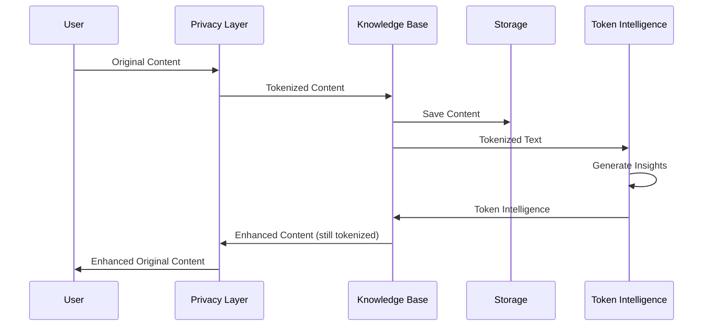

# Architecture Overview

This document provides a high-level overview of the Knowledge Base & Token Intelligence System architecture, with a focus on the integration between components and privacy-preserving design.

## System Components

The system consists of three main components:

1. **Knowledge Base Manager**: Organizes and processes content, extracts information, and handles storage
2. **Token Intelligence System**: Generates insights from tokenized content without accessing original data
3. **Sankofa Privacy Layer**: Handles tokenization of sensitive information and protects privacy

## Component Architecture

### Knowledge Base Manager

```
┌─────────────────────────────────────────┐
│           Knowledge Base Manager        │
├─────────────┬───────────────────────────┤
│             │                           │
│  Manager    │  Content Types            │
│             │  - Note                   │
├─────────────┤  - Todo                   │
│             │  - CalendarEvent          │
│  Utils      │  - Project                │
│             │  - Reference              │
└─────────────┴───────────────────────────┘
```

- **Manager**: Core class that handles content processing and organization
- **Content Types**: Data classes for different types of content
- **Utils**: Configuration, helpers, and utility functions

### Token Intelligence System

```
┌─────────────────────────────────────────┐
│         Token Intelligence System       │
├─────────────┬───────────────┬───────────┤
│             │               │           │
│  Core       │  Intelligence │  API      │
│  - Engine   │  - Generators │  - REST   │
│  - Models   │  - Analyzers  │  - Batch  │
├─────────────┼───────────────┼───────────┤
│             │               │           │
│  Storage    │  Utils        │           │
│             │               │           │
└─────────────┴───────────────┴───────────┘
```

- **Core**: Main engine and data models
- **Intelligence**: Generators and analyzers for different token types
- **API**: REST API for accessing token intelligence
- **Storage**: Token profile and relationship storage
- **Utils**: Configuration, logging, validation

### Sankofa Privacy Layer

```
┌─────────────────────────────────────────┐
│            Sankofa Privacy Layer        │
├─────────────┬───────────────┬───────────┤
│             │               │           │
│ Tokenization│  Mapping      │ Validation│
│             │               │           │
└─────────────┴───────────────┴───────────┘
```

- **Tokenization**: Replaces sensitive data with tokens
- **Mapping**: Maintains mappings between tokens and original data
- **Validation**: Ensures privacy is maintained

## Data Flow

The complete data flow through the system:



1. User creates content with sensitive information
2. Privacy Layer tokenizes sensitive information
3. Knowledge Base processes and organizes tokenized content
4. Token Intelligence analyzes tokens and generates insights
5. Knowledge Base enhances content with token intelligence
6. Privacy Layer de-tokenizes content before returning to user

## Integration Points

### Knowledge Base to Token Intelligence

The Knowledge Base sends tokenized content to the Token Intelligence system:

```python
# Knowledge Base extracts tokenized text
tokenized_text = "Meeting with [PERSON_001] about [PROJECT_002]"

# Create Token Intelligence request
request = TokenIntelligenceRequest(
    privacy_text=tokenized_text,
    preserved_context=extracted_context,
    session_id="session-123"
)

# Get intelligence
response = engine.generate_intelligence(request)

# Use intelligence to enhance content
enhanced_content = original_content
for token, insight in response.intelligence.items():
    enhanced_content = apply_insight(enhanced_content, token, insight)
```

### Privacy Layer Integration

The Knowledge Base integrates with the Privacy Layer through the Privacy Integration module:

```python
# Import content through the Privacy Layer
result = privacy_integration.import_privacy_bundle("bundle.json")

# Export content through the Privacy Layer
export_result = privacy_integration.export_to_privacy_bundle()

# Process streaming content
result = privacy_integration.process_privacy_stream(stream_data)
```

## Memory Model

```
┌───────────────┐           ┌───────────────┐
│ Content Store │           │ Token Profiles│
│               │           │               │
│ - Notes       │           │ - Patterns    │
│ - Todos       │           │ - Context     │
│ - Events      │           │ - Frequency   │
│ - Projects    │           │               │
└───────┬───────┘           └───────┬───────┘
        │                           │
        v                           v
┌───────────────┐           ┌───────────────┐
│ Knowledge Base│<--------->│Token           │
│ Manager       │           │Intelligence   │
└───────────────┘           └───────────────┘
```

- **Content Store**: Persists content and metadata
- **Token Profiles**: Stores token-based intelligence and patterns
- **No Original Data**: Token profiles never contain original identifiable data

## Privacy Architecture

Privacy is the core architectural principle:

1. **Tokenization Boundary**: Sensitive data never crosses the tokenization boundary
2. **Perfect Token Isolation**: Token Intelligence only ever sees tokens, never original data
3. **Session Maintenance**: The system maintains consistent token mapping within sessions
4. **Privacy Validation**: All operations are validated for privacy compliance

## API Architecture

The system exposes two separate but complementary APIs:

```
┌─────────────────────┐     ┌─────────────────────┐
│ Knowledge Base API  │     │Token Intelligence API│
├─────────────────────┤     ├─────────────────────┤
│/process_content     │     │/analyze_tokens      │
│/search              │     │/analyze_batch       │
│/organize            │     │/health              │
└─────────────────────┘     └─────────────────────┘
```

Both APIs can be used independently or together, depending on the use case.

## Configuration Architecture

The system uses a hierarchical configuration system:

1. **Default configurations**: Hardcoded sensible defaults
2. **Configuration files**: YAML files for customization
3. **Environment variables**: Override for deployment-specific settings

## Technical Stack

- **Language**: Python 3.8+
- **API**: Flask
- **Storage**: File-based with JSON and Markdown
- **Configuration**: YAML
- **Packaging**: Standard Python packaging 