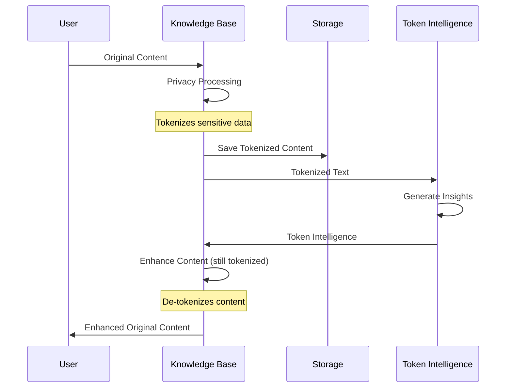

# Architecture Overview

This document provides a high-level overview of the Knowledge Base & Token Intelligence System architecture, with a focus on the privacy-preserving design.

## System Components

The system consists of two main components with integrated privacy features:

1. **Knowledge Base Manager**: Organizes and processes content, extracts information, handles storage, and includes integrated privacy functionality
2. **Token Intelligence System**: Generates insights from tokenized content without accessing original data

## Component Architecture

### Knowledge Base Manager

```
┌───────────────────────────────────────────────────────┐
│                Knowledge Base Manager                 │
├─────────────┬───────────────────────┬─────────────────┤
│             │                       │                 │
│  Manager    │  Content Types        │  Privacy        │
│             │  - Note               │  - Engine       │
├─────────────┤  - Todo               │  - Session Mgr  │
│             │  - CalendarEvent      │  - TokenBridge  │
│  Utils      │  - Project            │                 │
│             │  - Reference          │                 │
└─────────────┴───────────────────────┴─────────────────┘
```

- **Manager**: Core class that handles content processing and organization
- **Content Types**: Data classes for different types of content
- **Utils**: Configuration, helpers, and utility functions
- **Privacy**: Integrated privacy components for anonymization and session management

### Token Intelligence System

```
┌─────────────────────────────────────────┐
│         Token Intelligence System       │
├─────────────┬───────────────┬───────────┤
│             │               │           │
│  Core       │  Intelligence │  API      │
│  - Engine   │  - Generators │  - REST   │
│  - Models   │  - Analyzers  │  - Batch  │
├─────────────┼───────────────┼───────────┤
│             │               │           │
│  Storage    │  Utils        │           │
│             │               │           │
└─────────────┴───────────────┴───────────┘
```

- **Core**: Main engine and data models
- **Intelligence**: Generators and analyzers for different token types
- **API**: REST API for accessing token intelligence
- **Storage**: Token profile and relationship storage
- **Utils**: Configuration, logging, validation

## Data Flow

The complete data flow through the system:



1. User creates content with sensitive information
2. Knowledge Base tokenizes sensitive information through integrated privacy engine
3. Knowledge Base processes and organizes tokenized content
4. Token Intelligence analyzes tokens and generates insights
5. Knowledge Base enhances content with token intelligence
6. Knowledge Base de-tokenizes content before returning to user

## Integration Points

### Knowledge Base to Token Intelligence

The Knowledge Base communicates with the Token Intelligence system through the TokenIntelligenceBridge:

```python
# Knowledge Base extracts tokenized text
tokenized_text = "Meeting with [PERSON_001] about [PROJECT_002]"

# Create Token Intelligence request through the bridge
token_intelligence = token_intelligence_bridge.generate_intelligence(
    privacy_text=tokenized_text,
    session_id=session_id,
    preserved_context=context_keywords,
    entity_relationships=relationships
)

# Use intelligence to enhance content
enhanced_content = original_content
for token, insight in token_intelligence.items():
    enhanced_content = apply_insight(enhanced_content, token, insight)
```

### Privacy Integration

The privacy functionality is now integrated directly into the Knowledge Base:

```python
# Process content with privacy
result = knowledge_base.process_with_privacy(
    content="Call John Smith about the project tomorrow",
    session_id="session-123",
    privacy_level="balanced"
)

# Process and generate a response with automatic privacy handling
response = knowledge_base.process_and_respond(
    content="Schedule a meeting with Susan Jones",
    session_id="session-123"
)
```

## Memory Model

```
┌───────────────┐           ┌───────────────┐
│ Content Store │           │ Token Profiles│
│               │           │               │
│ - Notes       │           │ - Patterns    │
│ - Todos       │           │ - Context     │
│ - Events      │           │ - Frequency   │
│ - Projects    │           │               │
└───────┬───────┘           └───────┬───────┘
        │                           │
        v                           v
┌───────────────────────────────┐   │
│                               │   │
│ Knowledge Base Manager        │◄──┘
│ (with integrated privacy)     │
│                               │
└──────────────┬────────────────┘
               │
               │
        ┌──────▼──────┐
        │     UI      │
        │             │
        └─────────────┘
```

- **Content Store**: Persists content and metadata
- **Token Profiles**: Stores token-based intelligence and patterns
- **No Original Data**: Token profiles never contain original identifiable data

## Privacy Architecture

Privacy is built directly into the Knowledge Base Manager:

1. **Integrated Privacy Engine**: Handles tokenization and de-tokenization
2. **Session Manager**: Maintains privacy sessions for consistent tokenization
3. **Token Intelligence Bridge**: Connects to Token Intelligence with fallback capabilities
4. **Perfect Token Isolation**: Token Intelligence only ever sees tokens, never original data
5. **Privacy Validation**: All operations are validated for privacy compliance

## API Architecture

The system exposes a unified API with privacy-aware endpoints:

```
┌───────────────────────────────┐     
│ Knowledge Base API            │     
├───────────────────────────────┤     
│/process                       │     
│/process-private               │     
│/search                        │     
│/conversation                  │     
│/sessions                      │     
└───────────────────────────────┘     
```

All API endpoints automatically handle privacy when needed.

## Configuration Architecture

The system uses a hierarchical configuration system:

1. **Default configurations**: Hardcoded sensible defaults
2. **Configuration files**: YAML files for customization
3. **Environment variables**: Override for deployment-specific settings

## Technical Stack

- **Language**: Python 3.8+
- **API**: FastAPI
- **Storage**: File-based with JSON and Markdown
- **Configuration**: YAML
- **Packaging**: Standard Python packaging 