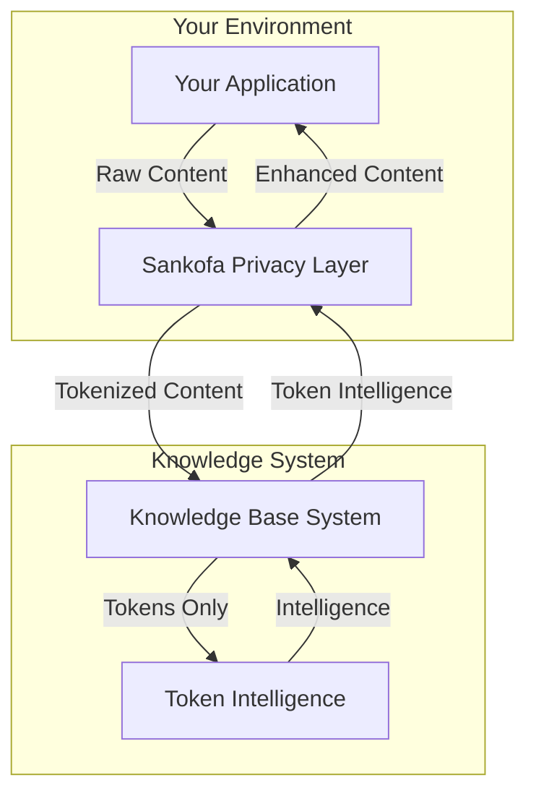

# Integration Guide

This guide explains how to integrate your applications with the Knowledge Base & Token Intelligence System, with particular focus on privacy-preserving integrations through the Sankofa privacy layer.

## Overview

Our system is designed for seamless integration through:

1. **REST API** - Connect any application using standard HTTP requests
2. **Python Library** - Direct integration for Python applications
3. **Privacy Layer** - Connect through the Sankofa privacy system for enhanced privacy

## API Integration

### Basic API Usage

The system provides a REST API for integration:

```bash
# Example: Process tokens through the API
curl -X POST http://localhost:5000/analyze_privacy_tokens \
  -H "Content-Type: application/json" \
  -d '{
    "privacy_text": "Meeting with [PERSON_001] about [PROJECT_002]",
    "session_id": "api-session-123",
    "preserved_context": ["meeting", "project"],
    "entity_relationships": {
      "[PERSON_001]": {"type": "person", "linked_entities": ["[PROJECT_002]"]},
      "[PROJECT_002]": {"type": "project", "belongs_to": "[PERSON_001]"}
    }
  }'
```

### API Endpoints

The main API endpoints are:

| Endpoint | Method | Purpose |
|----------|--------|---------|
| `/analyze_privacy_tokens` | POST | Process a single token intelligence request |
| `/analyze_privacy_tokens_batch` | POST | Process multiple requests efficiently |
| `/health` | GET | Check service status |

For detailed API documentation, see [API Reference](api.md).

## Python Library Integration

### Basic Library Usage

```python
from knowledge_base import KnowledgeBaseManager
from token_intelligence import TokenIntelligenceEngine

# Initialize components
kb = KnowledgeBaseManager()
engine = TokenIntelligenceEngine()

# Use the knowledge base
result = kb.process_stream_of_consciousness("Your content here")

# Use token intelligence
response = engine.generate_intelligence(
    privacy_text="Meeting with [PERSON_001]",
    preserved_context=["meeting"],
    session_id="library-session"
)
```

### Advanced Usage

For more advanced library usage, see the [examples directory](../examples/).

## Sankofa Privacy Layer Integration

The most important integration is with the Sankofa privacy layer, which enables privacy-preserving intelligence generation.

### What is Sankofa?

Sankofa is our specialized privacy layer that:
1. Tokenizes sensitive information in your content
2. Maintains the mapping between tokens and original data
3. Handles detokenization when returning results
4. Ensures privacy compliance throughout the process

### Integration Architecture



### Sankofa Integration Steps

Follow these steps to integrate with the Sankofa privacy layer:

#### 1. Install the Sankofa Client

```bash
pip install sankofa-client
```

#### 2. Configure Sankofa

Create a configuration file (e.g., `sankofa_config.yaml`):

```yaml
sankofa:
  api_key: "your-api-key"
  tokenization:
    person_pattern: "[PERSON_\\d+]"
    project_pattern: "[PROJECT_\\d+]"
    physician_pattern: "[PHYSICIAN_\\d+]"
    condition_pattern: "[CONDITION_\\d+]"
  privacy_level: "high"
```

#### 3. Initialize Sankofa in Your Application

```python
from sankofa import SankofoClient
from knowledge_base import KnowledgeBaseManager
from token_intelligence import TokenIntelligenceEngine

# Initialize Sankofa
sankofa = SankofoClient("sankofa_config.yaml")

# Initialize Knowledge Base and Token Intelligence
kb = KnowledgeBaseManager()
engine = TokenIntelligenceEngine()

# Process content through Sankofa
original_content = "Meeting with Dr. Smith about Project Alpha"
tokenized_content = sankofa.tokenize(original_content)

# Now process using the knowledge base
kb_result = kb.process_stream_of_consciousness(tokenized_content)

# Get token intelligence
intelligence_response = engine.generate_intelligence(
    privacy_text=tokenized_content,
    preserved_context=["meeting", "project"],
    session_id="sankofa-session"
)

# Detokenize the response
enhanced_content = sankofa.detokenize(intelligence_response.intelligence)
```

#### 4. Import/Export with Sankofa

For bulk operations, use the SankofoIntegration class:

```python
from scripts.sankofa_integration import SankofoIntegration
from knowledge_base import KnowledgeBaseManager

# Initialize
kb = KnowledgeBaseManager()
integration = SankofoIntegration(kb)

# Import a Sankofa bundle
result = integration.import_sankofa_bundle("path/to/sankofa_bundle.json")

# Export to Sankofa format
export_result = integration.export_to_sankofa()
```

### Privacy-Safe Streaming

For real-time processing, use the stream processing capability:

```python
# Process streaming data
stream_data = sankofa.tokenize_stream("Live content with sensitive information")

result = integration.stream_process(stream_data)
```

## Best Practices for Integration

### 1. Maintain Session Consistency

Always use consistent session IDs for related operations:

```python
session_id = "user123-project456-2025-06-23"

# Use the same session ID across calls
result1 = engine.generate_intelligence(
    privacy_text="First request",
    session_id=session_id
)

result2 = engine.generate_intelligence(
    privacy_text="Second related request",
    session_id=session_id
)
```

### 2. Provide Rich Context

Include relevant contextual information:

```python
response = engine.generate_intelligence(
    privacy_text="Meeting with [PERSON_001]",
    preserved_context=["quarterly", "report", "financial", "review"],
    session_id="session-123"
)
```

### 3. Specify Entity Relationships

Define relationships between tokens for better intelligence:

```python
response = engine.generate_intelligence(
    privacy_text="Meeting with [PERSON_001] about [PROJECT_002]",
    preserved_context=["meeting"],
    entity_relationships={
        "[PERSON_001]": {"type": "person", "role": "manager", "linked_entities": ["[PROJECT_002]"]},
        "[PROJECT_002]": {"type": "project", "status": "active", "belongs_to": "[PERSON_001]"}
    },
    session_id="session-123"
)
```

### 4. Use Batch Processing

For multiple related requests, use batch processing:

```python
from token_intelligence import BatchTokenRequest

batch_request = BatchTokenRequest(
    requests=[request1, request2, request3],
    batch_id="batch-123",
    session_id="session-456"
)

batch_response = engine.generate_batch_intelligence(batch_request)
```

### 5. Handle Different Content Types

Adjust your integration based on content type:

```python
# For notes
note_result = kb.process_stream_of_consciousness("Free-form text with ideas...")

# For tasks
todo_text = "Remember to finish the report by Friday"
todo_result = kb.process_stream_of_consciousness(todo_text)
todos = todo_result["extracted_info"]["todos"]

# For calendar events
event_text = "Meeting tomorrow at 2pm about quarterly results"
event_result = kb.process_stream_of_consciousness(event_text)
events = event_result["extracted_info"]["calendar_events"]
```

## Privacy Considerations

When integrating with our system:

1. **Never send raw sensitive data** directly to the Token Intelligence System
2. **Always use the Sankofa privacy layer** for sensitive information
3. **Follow data minimization principles** - only send what's necessary
4. **Maintain clear boundaries** between tokenized and raw data
5. **Use appropriate session isolation** for different contexts

## Troubleshooting

### Common Integration Issues

1. **Missing Tokens**: Ensure Sankofa is properly configured to tokenize all sensitive entities
2. **Session Inconsistency**: Verify session IDs are consistent across related requests
3. **Context Limitations**: Check that preserved_context contains relevant keywords
4. **API Connectivity**: Verify network access to the API endpoints
5. **Privacy Validation Failures**: Ensure no raw personal data is sent to the Token Intelligence System

### Debugging Tips

1. Enable debug logging:
   ```python
   import logging
   logging.basicConfig(level=logging.DEBUG)
   ```

2. Validate tokenization:
   ```python
   # Check if tokenization is working
   original = "John Smith"
   tokenized = sankofa.tokenize(original)
   print(f"Original: {original}, Tokenized: {tokenized}")
   assert "[PERSON_" in tokenized
   ```

3. Verify token intelligence processing:
   ```python
   response = engine.generate_intelligence(privacy_text="[PERSON_001]")
   print(f"Response valid: {bool(response.intelligence)}")
   ```

## Need More Help?

For additional assistance:
- Check our [API Documentation](api.md)
- Review [Example Code](../examples/)
- Contact us at integration-support@knowledge-system.com 