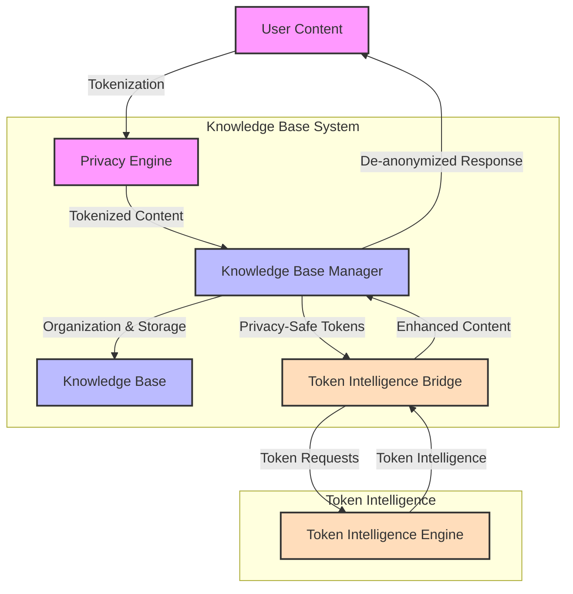
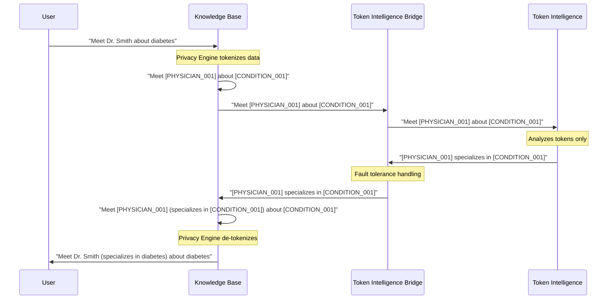

# Privacy Design: How We Protect Your Data

This document explains how our system protects your privacy through innovative token-based intelligence and the integrated privacy functionality within the Knowledge Base system.

## Privacy by Design

The Knowledge Base System was built from the ground up with privacy as a core principle. Instead of trying to add privacy to an existing system, we designed our architecture around privacy protection from the beginning.

## Privacy Architecture



## The Integrated Privacy Approach

### How Traditional Systems Work

In traditional systems, your personal data is:
1. Collected in its original form
2. Processed directly by AI and analytics
3. Stored in databases that contain identifiable information
4. At risk of exposure through breaches or misuse

### How Our System Works

Our approach is fundamentally different:
1. Your data is **immediately tokenized** by the integrated Privacy Engine
2. Only these anonymous tokens are processed by our intelligence system
3. The system **never sees** the original sensitive information
4. The Knowledge Base maintains the mapping between tokens and real data

## What Are Privacy Tokens?

Privacy tokens are anonymous placeholders that replace sensitive information:

```
Original: "Call Dr. Smith about diabetes management"
Tokenized: "Call [PHYSICIAN_001] about [CONDITION_001] management"
```

Our system only processes the tokenized version, never the original.

## Token-Only Processing

The Token Intelligence system operates under strict privacy constraints:

1. **Token-Only Input**: Only receives tokenized text
2. **Token-Only Storage**: Only stores token profiles, never original data
3. **Token-Only Output**: Only returns insights about tokens
4. **Zero Re-identification Risk**: Has no mechanism to reverse the tokenization

## Privacy Guarantees

We can make the following guarantees about your data:

### 1. Zero Data Exposure
- The Token Intelligence System never sees original data
- No personal data is ever stored in the intelligence system
- No identifiers are transmitted across the privacy boundary

### 2. Perfect Token Isolation
- All operations work exclusively with tokens
- Token mappings are maintained only in the Privacy Engine
- Intelligence is generated without knowledge of what the tokens represent

### 3. Session Isolation
- Different usage contexts are kept completely separate
- Token assignments are consistent within sessions but not across unrelated sessions
- No cross-session correlation without explicit user permission

## Privacy-Safe Intelligence Generation

How can we generate useful intelligence without seeing your data? Through these techniques:

1. **Context Preservation**: When data is tokenized, contextual information is preserved
2. **Relationship Tracking**: We map relationships between tokens without knowing what they represent
3. **Pattern Recognition**: We identify patterns in token usage and context
4. **Continuous Learning**: The system learns from token interactions over time

## Data Flow with Privacy Preservation

Here's how data flows through the system with privacy protection:



## Technical Implementation

For technically-minded readers, the privacy protection works through these key components:

### 1. Integrated Privacy Engine

The core privacy component is the `PrivacyEngine` class which handles:

- **Smart Tokenization**: Identifies and tokenizes sensitive information using sophisticated pattern recognition
- **Token Management**: Ensures consistent token usage within sessions
- **Entity Relationship Tracking**: Maps relationships between tokenized entities
- **Context Preservation**: Maintains essential context for AI processing
- **Privacy Level Configuration**: Supports different privacy levels (strict, balanced, minimal)

### 2. Pattern Detection System

The pattern detection system uses a comprehensive set of regex patterns to identify various types of sensitive information:

- **Person Names**: Multiple pattern types including standard names, titled names, hyphenated names
- **Phone Numbers**: Various formats including standard, parenthesized, and international formats
- **Email Addresses**: Standard and non-standard email format detection
- **Locations**: Street addresses, city names, geographical references
- **Projects**: Project names, team names, initiative references
- **Custom Entities**: Extensible system for domain-specific entity detection

### 3. Entity Relationship Detection

The relationship detection system automatically identifies connections between entities:

- **Type-based Relationships**: Predefined relationships between entity types (e.g., person-email)
- **Text Proximity Analysis**: Entities appearing close together are potentially related
- **Content Analysis**: Smart detection of relationships in text context
- **Consistent Mapping**: Ensuring relationship consistency across texts

### 4. Session Manager

The `PrivacySessionManager` provides:

- **Session Isolation**: Each usage context has a separate privacy session
- **Token Consistency**: Ensures tokens remain consistent within a session
- **Context Tracking**: Maintains preserved context for AI enhancement
- **Persistent Storage**: Securely stores session data for later use
- **Session Lifecycle Management**: Creates, updates, and deletes sessions as needed

### 5. Token Intelligence Bridge

The Token Intelligence Bridge provides:

- **Fault Tolerance**: Continues functioning even if the Token Intelligence system is unavailable
- **Graceful Degradation**: Provides basic intelligence even without the full intelligence system
- **Dependency Management**: Automatically detects if Token Intelligence is available
- **Error Handling**: Captures and isolates errors from the intelligence system
- **Context Enhancement**: Enriches tokenized content with context for AI processing

### Performance Considerations

The privacy implementation is carefully optimized for performance:

- **Efficient Regex Patterns**: Optimized for speed and accuracy
- **Token Caching**: Fast lookup of existing tokens via inverse mapping
- **Staged Processing**: Multi-stage processing pipeline for better performance
- **Minimal Overhead**: Privacy protection adds minimal latency (~0.1-3ms for typical text)

## Privacy Testing and Validation

The system includes dedicated privacy validation that:

1. Verifies no personal data crosses the privacy boundary
2. Ensures all operations use tokens exclusively
3. Validates that responses cannot be used for re-identification
4. Provides comprehensive privacy metrics and audit logs

### Test Coverage

Our privacy components have achieved 93% test coverage, including:

- **Unit Tests**: 33+ tests covering all privacy functions
- **Integration Tests**: Complete end-to-end workflow testing
- **Performance Benchmarks**: Established baselines for key operations
- **Edge Cases**: Comprehensive testing of boundary conditions

For detailed test coverage information, see the [Test Coverage Report](test_coverage.md).

## How to Verify Our Privacy Claims

We believe in transparency and invite you to verify our privacy claims:

1. Review the Privacy Engine implementation in `knowledge_base/privacy/smart_anonymization.py`
2. Examine the Session Manager in `knowledge_base/privacy/session_manager.py`
3. Check the Token Intelligence Bridge in `knowledge_base/privacy/token_intelligence_bridge.py`
4. Inspect token processing in `token_intelligence/core/token_extractor.py`
5. Run the system in debug mode to trace data flows

## Further Reading

For more technical details on our privacy implementation, see:

- [Architecture Overview](architecture_overview.md) - System design with privacy boundaries
- [Integration Guide](integration_guide.md) - How to integrate while maintaining privacy
- [Knowledge Base API](../scripts/api_server.py) - API implementation with privacy safeguards 