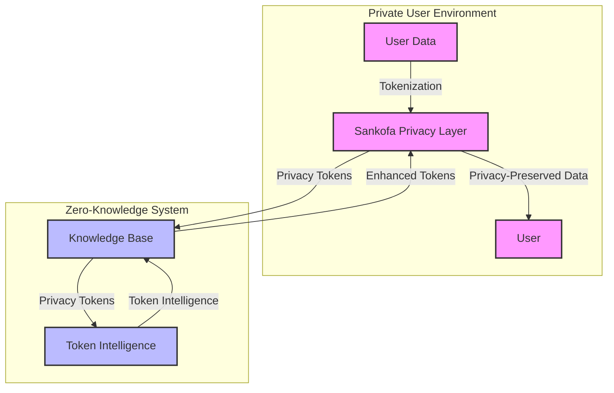
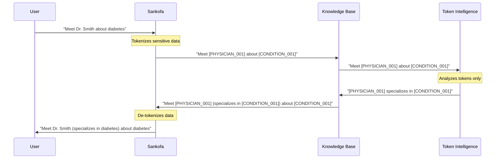

# Privacy Design: How We Protect Your Data

This document explains how our system protects your privacy through innovative token-based intelligence and the Sankofa privacy layer integration.

## Privacy by Design

The Knowledge Base & Token Intelligence System was built from the ground up with privacy as a core principle. Instead of trying to add privacy to an existing system, we designed our architecture around privacy protection from the beginning.

## Privacy Architecture



## The Privacy Layer Approach

### How Traditional Systems Work

In traditional systems, your personal data is:
1. Collected in its original form
2. Processed directly by AI and analytics
3. Stored in databases that contain identifiable information
4. At risk of exposure through breaches or misuse

### How Our System Works

Our approach is fundamentally different:
1. Your data is **immediately tokenized** - sensitive information is replaced with privacy tokens
2. Only these anonymous tokens are processed by our intelligence system
3. The system **never sees** the original sensitive information
4. The privacy layer (Sankofa) maintains the mapping between tokens and real data

## What Are Privacy Tokens?

Privacy tokens are anonymous placeholders that replace sensitive information:

```
Original: "Call Dr. Smith about diabetes management"
Tokenized: "Call [PHYSICIAN_001] about [CONDITION_001] management"
```

Our system only processes the tokenized version, never the original.

## Token-Only Processing

The Token Intelligence system operates under strict privacy constraints:

1. **Token-Only Input**: Only receives tokenized text
2. **Token-Only Storage**: Only stores token profiles, never original data
3. **Token-Only Output**: Only returns insights about tokens
4. **Zero Re-identification Risk**: Has no mechanism to reverse the tokenization

## Privacy Guarantees

We can make the following guarantees about your data:

### 1. Zero Data Exposure
- The Token Intelligence System never sees original data
- No personal data is ever stored in the intelligence system
- No identifiers are transmitted across the privacy boundary

### 2. Perfect Token Isolation
- All operations work exclusively with tokens
- Token mappings are maintained only in the Sankofa Privacy Layer
- Intelligence is generated without knowledge of what the tokens represent

### 3. Session Isolation
- Different usage contexts are kept completely separate
- Token assignments are consistent within sessions but not across unrelated sessions
- No cross-session correlation without explicit user permission

## Privacy-Safe Intelligence Generation

How can we generate useful intelligence without seeing your data? Through these techniques:

1. **Context Preservation**: When data is tokenized, contextual information is preserved
2. **Relationship Tracking**: We map relationships between tokens without knowing what they represent
3. **Pattern Recognition**: We identify patterns in token usage and context
4. **Continuous Learning**: The system learns from token interactions over time

## Data Flow with Privacy Preservation

Here's how data flows through the system with privacy protection:



## Technical Implementation

For technically-minded readers, the privacy protection works through:

1. **Token Extraction**: Privacy tokens are identified using pattern matching
2. **Context Preservation**: Non-sensitive context words are preserved
3. **Intelligence Generation**: Algorithms work exclusively with tokens and context
4. **Token Response Formatting**: Intelligence is attached to tokens, not original data

## Privacy Testing and Validation

The system includes dedicated privacy validation that:

1. Verifies no personal data crosses the privacy boundary
2. Ensures all operations use tokens exclusively
3. Validates that responses cannot be used for re-identification
4. Provides comprehensive privacy metrics and audit logs

## How to Verify Our Privacy Claims

We believe in transparency and invite you to verify our privacy claims:

1. Review the Privacy Validator implementation in `knowledge_base/privacy.py`
2. Examine our privacy tests in the `tests/` directory
3. Inspect token processing in `token_intelligence/core/token_extractor.py`
4. Run the system in debug mode to trace data flows

## Further Reading

For more technical details on our privacy implementation, see:

- [Architecture Overview](architecture_overview.md) - System design with privacy boundaries
- [Integration Guide](integration_guide.md) - How to integrate while maintaining privacy
- [Privacy Layer API](../token_intelligence/api/endpoints.py) - API implementation with privacy safeguards 