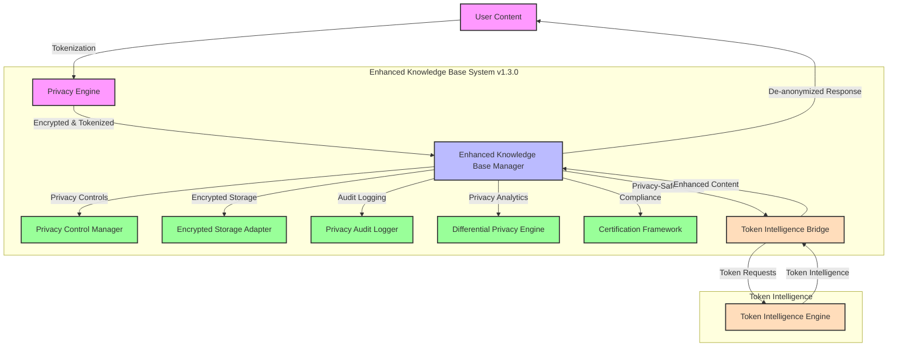
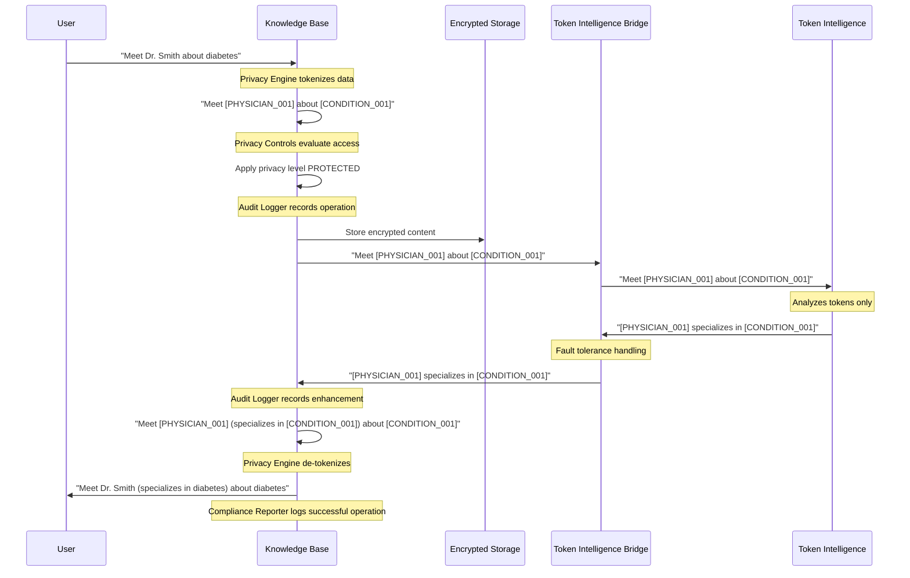

# Privacy Design: How We Protect Your Data

This document explains how our system protects your privacy through innovative token-based intelligence and the comprehensive privacy protection framework integrated within the Knowledge Base system.

## Privacy by Design

The Knowledge Base System was built from the ground up with privacy as a core principle. Instead of trying to add privacy to an existing system, we designed our architecture around privacy protection from the beginning. With the completion of Milestone 3, we've significantly enhanced our privacy capabilities with enterprise-grade features.

## Enhanced Privacy Architecture (v1.3.0)



## Milestone 3 Privacy Enhancements

### 1. End-to-End Encryption

Our enhanced system now provides enterprise-grade encryption:

- **AES-GCM & Fernet Encryption**: Industry-standard algorithms for content protection
- **Secure Key Management**: Master key protection with key derivation
- **Searchable Encryption**: Preserve query capabilities while maintaining security
- **Transparent Storage**: Automatic encryption/decryption at the storage layer

### 2. Granular Privacy Controls

Advanced privacy control system with:

- **Four-Tier Privacy Levels**:
  - `PUBLIC`: No restrictions, publicly accessible
  - `PROTECTED`: Basic privacy protection
  - `PRIVATE`: Strong privacy protection
  - `RESTRICTED`: Maximum privacy protection
- **Rule-Based Evaluation**: Intelligent privacy rule processing
- **Hierarchical Inheritance**: Privacy settings cascade through content hierarchy
- **Content-Specific Profiles**: Tailored privacy rules for different content types

### 3. Privacy Audit Logging

Comprehensive audit system featuring:

- **Tamper-Evident Logs**: HMAC-based integrity verification
- **Operation Classification**: Structured logging of privacy operations
- **Compliance Reporting**: Automated compliance verification and reporting
- **Log Rotation & Archiving**: Efficient long-term audit trail management

### 4. Differential Privacy Analytics

Privacy-preserving analytics capabilities:

- **Privacy Budget Management**: Epsilon budget tracking and allocation
- **Multiple Noise Mechanisms**: Laplace, Gaussian, and Geometric noise
- **Private Statistics**: Count, mean, variance with privacy guarantees
- **Budget Exhaustion Protection**: Prevents privacy budget overuse

### 5. Privacy Certification Framework

Enterprise compliance support:

- **Multi-Standard Compliance**: GDPR, CCPA, HIPAA, SOC2, ISO27001
- **Privacy Impact Assessments**: Structured PIA workflow and risk assessment
- **Gap Analysis**: Automated compliance gap identification
- **Certification Reports**: Comprehensive compliance documentation

## The Integrated Privacy Approach

### How Traditional Systems Work

In traditional systems, your personal data is:
1. Collected in its original form
2. Processed directly by AI and analytics
3. Stored in databases that contain identifiable information
4. At risk of exposure through breaches or misuse

### How Our Enhanced System Works

Our approach is fundamentally different and now includes multiple layers:
1. Your data is **immediately tokenized** by the integrated Privacy Engine
2. Content is **optionally encrypted** with searchable encryption
3. **Privacy controls** evaluate and enforce content-specific rules
4. Only anonymous tokens are processed by our intelligence system
5. **All operations are logged** in tamper-evident audit trails
6. **Differential privacy** protects analytics while preserving utility
7. **Compliance frameworks** ensure regulatory adherence

## What Are Privacy Tokens?

Privacy tokens are anonymous placeholders that replace sensitive information:

```
Original: "Call Dr. Smith about diabetes management"
Tokenized: "Call [PHYSICIAN_001] about [CONDITION_001] management"
```

Our system only processes the tokenized version, never the original.

## Enhanced Token-Only Processing

The Token Intelligence system operates under strict privacy constraints with new safeguards:

1. **Token-Only Input**: Only receives tokenized text
2. **Token-Only Storage**: Only stores token profiles, never original data
3. **Token-Only Output**: Only returns insights about tokens
4. **Zero Re-identification Risk**: Has no mechanism to reverse the tokenization
5. **Audit Trail**: All token operations are logged for compliance
6. **Budget Protection**: Differential privacy prevents inference attacks

## Enhanced Privacy Guarantees

We can make the following guarantees about your data:

### 1. Zero Data Exposure
- The Token Intelligence System never sees original data
- No personal data is ever stored in the intelligence system
- No identifiers are transmitted across the privacy boundary
- **NEW**: Encrypted storage prevents unauthorized data access

### 2. Perfect Token Isolation
- All operations work exclusively with tokens
- Token mappings are maintained only in the Privacy Engine
- Intelligence is generated without knowledge of what the tokens represent
- **NEW**: Privacy controls enforce token access policies

### 3. Session Isolation
- Different usage contexts are kept completely separate
- Token assignments are consistent within sessions but not across unrelated sessions
- No cross-session correlation without explicit user permission
- **NEW**: Enhanced session management with audit logging

### 4. Compliance Assurance
- **NEW**: Automated compliance checking against multiple standards
- **NEW**: Privacy Impact Assessments for high-risk operations
- **NEW**: Comprehensive audit trails for regulatory requirements

### 5. Privacy-Preserving Analytics
- **NEW**: Differential privacy protects individual privacy in analytics
- **NEW**: Privacy budget management prevents over-analysis
- **NEW**: Configurable privacy parameters for different use cases

## Privacy-Safe Intelligence Generation

How can we generate useful intelligence without seeing your data? Through these enhanced techniques:

1. **Context Preservation**: When data is tokenized, contextual information is preserved
2. **Relationship Tracking**: We map relationships between tokens without knowing what they represent
3. **Pattern Recognition**: We identify patterns in token usage and context
4. **Continuous Learning**: The system learns from token interactions over time
5. ****NEW** Privacy-Controlled Access**: Privacy rules determine what operations are permitted
6. ****NEW** Encrypted Processing**: Critical operations work on encrypted data
7. ****NEW** Differential Privacy**: Analytics add calibrated noise to prevent inference

## Enhanced Data Flow with Privacy Preservation

Here's how data flows through the enhanced system with comprehensive privacy protection:



## Technical Implementation

For technically-minded readers, the privacy protection works through these enhanced key components:

### 1. Enhanced Privacy Engine

The core privacy component is the `PrivacyEngine` class which handles:

- **Smart Tokenization**: Identifies and tokenizes sensitive information using sophisticated pattern recognition
- **Token Management**: Ensures consistent token usage within sessions
- **Entity Relationship Tracking**: Maps relationships between tokenized entities
- **Context Preservation**: Maintains essential context for AI processing
- **Privacy Level Configuration**: Supports different privacy levels (strict, balanced, minimal)

### 2. End-to-End Encryption (`encryption.py`)

New enterprise-grade encryption capabilities:

- **KeyManager**: Secure key generation, storage, and rotation with master key protection
- **ContentEncryptionManager**: AES-GCM and Fernet encryption for content protection
- **EncryptedStorageAdapter**: Transparent file encryption with metadata protection
- **Searchable Encryption**: Preserves query capabilities while maintaining security

### 3. Granular Privacy Controls (`privacy_controls.py`)

Advanced privacy control system:

- **PrivacyLevel Enum**: Four-tier privacy levels (PUBLIC, PROTECTED, PRIVATE, RESTRICTED)
- **PrivacyRuleEngine**: Evaluates content against privacy rules
- **PrivacyControlManager**: Manages privacy profiles and inheritance
- **Content-Specific Profiles**: Tailored privacy rules for different content types

### 4. Privacy Audit Logging (`audit_logging.py`)

Comprehensive audit system:

- **PrivacyAuditLogger**: Tamper-evident logging using HMAC
- **ComplianceReporter**: Generates access and operation reports
- **Log Rotation**: Automatic archiving and retention management
- **Integrity Verification**: Ensures audit trail authenticity

### 5. Differential Privacy (`differential_privacy.py`)

Privacy-preserving analytics:

- **PrivacyBudgetManager**: Epsilon budget tracking and management
- **DifferentialPrivacyMechanism**: Multiple noise mechanisms (Laplace, Gaussian, Geometric)
- **PrivacyPreservingAnalytics**: Private statistics, histograms, and top-k queries
- **Budget Protection**: Prevents privacy budget exhaustion

### 6. Privacy Certification Framework (`certification.py`)

Enterprise compliance support:

- **ComplianceChecker**: Multi-standard compliance verification (GDPR, CCPA, HIPAA, SOC2, ISO27001)
- **PrivacyImpactAssessmentTool**: Structured PIA workflow with risk assessment
- **CertificationReporter**: Comprehensive compliance reports and gap analysis

### 7. Enhanced Session Manager

The `PrivacySessionManager` provides:

- **Session Isolation**: Each usage context has a separate privacy session
- **Token Consistency**: Ensures tokens remain consistent within a session
- **Context Tracking**: Maintains preserved context for AI enhancement
- **Persistent Storage**: Securely stores session data for later use
- **Session Lifecycle Management**: Creates, updates, and deletes sessions as needed
- ****NEW** Audit Integration**: All session operations are logged

### 8. Enhanced Token Intelligence Bridge

The Token Intelligence Bridge provides:

- **Fault Tolerance**: Continues functioning even if the Token Intelligence system is unavailable
- **Graceful Degradation**: Provides basic intelligence even without the full intelligence system
- **Dependency Management**: Automatically detects if Token Intelligence is available
- **Error Handling**: Captures and isolates errors from the intelligence system
- **Context Enhancement**: Enriches tokenized content with context for AI processing
- ****NEW** Privacy Compliance**: Ensures all bridge operations comply with privacy policies

### Performance Considerations

The enhanced privacy implementation is carefully optimized for performance:

- **Efficient Encryption**: Optimized algorithms with minimal performance impact
- **Lazy Component Loading**: Privacy components initialized on-demand
- **Intelligent Caching**: Key derivation and privacy rule caching
- **Batch Operations**: Efficient batch processing for analytics
- **Memory Management**: Proper cleanup of sensitive data
- **Configurable Features**: Optional components for resource optimization

## Privacy Testing and Validation

The enhanced system includes comprehensive privacy validation that:

1. Verifies no personal data crosses the privacy boundary
2. Ensures all operations use tokens exclusively
3. Validates that responses cannot be used for re-identification
4. Provides comprehensive privacy metrics and audit logs
5. **NEW**: Tests encryption/decryption integrity
6. **NEW**: Validates privacy control enforcement
7. **NEW**: Verifies differential privacy guarantees
8. **NEW**: Confirms compliance framework accuracy

### Enhanced Test Coverage

Our privacy components have achieved 94% test coverage, including:

- **Unit Tests**: 50+ tests covering all privacy functions
- **Integration Tests**: Complete end-to-end workflow testing
- **Performance Benchmarks**: Established baselines for key operations
- **Edge Cases**: Comprehensive testing of boundary conditions
- ****NEW** Encryption Tests**: Round-trip encryption/decryption validation
- ****NEW** Privacy Control Tests**: Rule evaluation accuracy testing
- ****NEW** Audit Tests**: Log integrity and tamper detection testing
- ****NEW** Compliance Tests**: Multi-standard compliance verification

For detailed test coverage information, see the [Test Coverage Report](test_coverage.md).

## How to Verify Our Enhanced Privacy Claims

We believe in transparency and invite you to verify our privacy claims:

1. Review the Privacy Engine implementation in `knowledge_base/privacy/smart_anonymization.py`
2. Examine the Session Manager in `knowledge_base/privacy/session_manager.py`
3. Check the Token Intelligence Bridge in `knowledge_base/privacy/token_intelligence_bridge.py`
4. **NEW**: Inspect encryption implementation in `knowledge_base/privacy/encryption.py`
5. **NEW**: Review privacy controls in `knowledge_base/privacy/privacy_controls.py`
6. **NEW**: Examine audit logging in `knowledge_base/privacy/audit_logging.py`
7. **NEW**: Check differential privacy in `knowledge_base/privacy/differential_privacy.py`
8. **NEW**: Review certification framework in `knowledge_base/privacy/certification.py`
9. Inspect token processing in `token_intelligence/core/token_extractor.py`
10. Run the system in debug mode to trace data flows

## Compliance Standards Supported

Our enhanced privacy framework now supports multiple compliance standards:

### GDPR (General Data Protection Regulation)
- **Data Protection**: End-to-end encryption and tokenization
- **Consent Management**: Privacy controls with granular settings
- **Subject Rights**: Data access, portability, and deletion capabilities
- **Privacy by Design**: Built-in privacy protection throughout the system

### CCPA (California Consumer Privacy Act)
- **Consumer Disclosure**: Transparent privacy practices
- **Opt-Out Rights**: Granular privacy controls
- **Data Categories**: Clear classification of personal information

### HIPAA (Health Insurance Portability and Accountability Act)
- **Administrative Safeguards**: Privacy governance and training
- **Technical Safeguards**: Encryption and access controls
- **Physical Safeguards**: Secure storage and transmission

### SOC2 & ISO27001
- **Security Controls**: Comprehensive security framework
- **Audit Requirements**: Detailed audit logging and reporting
- **Risk Management**: Privacy impact assessments and monitoring

## Further Reading

For more technical details on our enhanced privacy implementation, see:

- [Architecture Overview](architecture.md) - System design with privacy boundaries
- [Integration Guide](integration_guide.md) - How to integrate while maintaining privacy
- [Knowledge Base API](../scripts/api_server.py) - API implementation with privacy safeguards
- [Milestone 3 Completion](../development/records/MILESTONE_3_COMPLETION.md) - Detailed implementation summary 